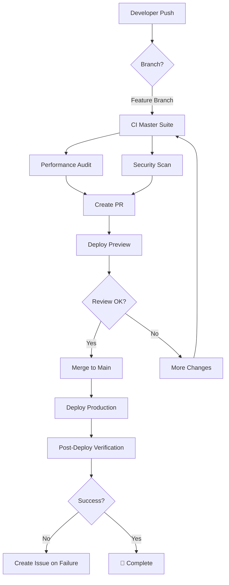

# 🚀 Workflows CI/CD - Resumen Rápido

## 📊 Estado de Workflows

| Workflow                     | Archivo                        | Trigger               | Propósito                    | Estado    |
| ---------------------------- | ------------------------------ | --------------------- | ---------------------------- | --------- |
| **CI Master Suite**          | `ci-master.yml`                | Push/PR a main/master | Lint, Type-check, Build, E2E | ✅ Activo |
| **Create Issues on Failure** | `create-issues-on-failure.yml` | Workflow completion   | Auto-crear issues en fallos  | ✅ Activo |
| **Performance Audit**        | `performance-audit.yml`        | Push/PR a main/master | Lighthouse + Bundle size     | ✅ Activo |
| **Security Scan**            | `security-scan.yml`            | Push/PR + Semanal     | Deps + Secrets detection     | ✅ Activo |
| **Auto Fix & Commit**        | `auto-fix-commit.yml`          | Push/PR               | Auto-fix lint errors         | ✅ Activo |
| **Deploy Preview**           | `deploy-preview.yml`           | PR opened/sync        | Preview en Vercel            | ✅ Activo |
| **Deploy Production**        | `deploy-production.yml`        | Push a main           | Deploy a producción          | ✅ Activo |
| **Dependency Update**        | `dependency-update.yml`        | Semanal (Lunes 9AM)   | Update deps automático       | ✅ Activo |

---

## 🎯 Workflows por Categoría

### 🧪 Calidad de Código

- `ci-master.yml` - Suite completa de CI
- `auto-fix-commit.yml` - Auto-fix y commits

### 🚀 Deployment

- `deploy-preview.yml` - Preview deployments
- `deploy-production.yml` - Production deployments

### 🔒 Seguridad

- `security-scan.yml` - Auditoría de seguridad completa

### 📊 Performance

- `performance-audit.yml` - Métricas y optimización

### 🤖 Automatización

- `create-issues-on-failure.yml` - Issue tracking automático
- `dependency-update.yml` - Mantenimiento de deps

---

## 🔄 Flujo de Trabajo Típico



---

## ⚡ Quick Commands

### Ver estado de workflows

```bash
# Listar todos los workflows
gh workflow list

# Ver runs recientes
gh run list --limit 10

# Ver un workflow específico
gh run list --workflow=ci-master.yml

# Ver logs de un run
gh run view <run-id> --log

# Cancelar un workflow en progreso
gh run cancel <run-id>

# Re-ejecutar un workflow fallido
gh run rerun <run-id>
```

### Ejecutar workflows manualmente

```bash
# Dispatch manual de cualquier workflow
gh workflow run ci-master.yml

# Con inputs
gh workflow run dependency-update.yml

# Ver workflows disponibles para dispatch
gh workflow list
```

---

## 📋 Checklist Pre-Merge

Antes de hacer merge a main, verificar:

- [ ] ✅ CI Master Suite pasó
- [ ] ✅ Performance Audit sin warnings críticos
- [ ] ✅ Security Scan sin vulnerabilidades high/critical
- [ ] ✅ Bundle size dentro de límites
- [ ] ✅ Deploy Preview funcional
- [ ] ✅ Code review completado
- [ ] ✅ Tests E2E pasaron

---

## 🔧 Configuración de Branch Protection

### Main Branch

```yaml
Required status checks:
  - Lint
  - Type Check
  - Build
  - E2E Tests
  - Performance Audit / Bundle Size Check
  - Security Scan / Dependency Audit

Required reviews: 1
Dismiss stale reviews: true
Require conversation resolution: true
```

---

## 📊 Métricas de Éxito

### Objetivos de CI/CD

| Métrica                  | Objetivo   | Actual |
| ------------------------ | ---------- | ------ |
| CI Success Rate          | > 95%      | 📊     |
| Build Time               | < 10 min   | ⏱️     |
| E2E Test Time            | < 15 min   | ⏱️     |
| Deploy Time              | < 5 min    | ⏱️     |
| Security Vulnerabilities | 0 critical | 🔒     |
| Lighthouse Score         | > 90       | 🚦     |

---

## 🐛 Troubleshooting Common Issues

### CI Falla en Lint

```bash
# Local fix
pnpm lint:fix
git add -A
git commit -m "fix: lint errors"
git push
```

### CI Falla en Type Check

```bash
# Local fix
pnpm type-check
# Fix errors, then:
git add -A
git commit -m "fix: type errors"
git push
```

### E2E Tests Fallan

```bash
# Run locally
pnpm test:e2e

# Update snapshots if needed
pnpm test:e2e --update-snapshots

# Debug mode
pnpm test:e2e --debug
```

### Deploy Falla

```bash
# Verify secrets are set
gh secret list

# Check Vercel status
vercel whoami

# Manual deploy
vercel --prod
```

---

## 📚 Documentación Detallada

Ver documentación completa en: [`docs/CI_CD_WORKFLOWS.md`](../docs/CI_CD_WORKFLOWS.md)

---

## 🆘 Soporte

**Issues de CI/CD:** Los workflows automáticamente crean issues cuando fallan.

**Contacto:** [@zoro488](https://github.com/zoro488)

**Última actualización:** 2025-12-15
