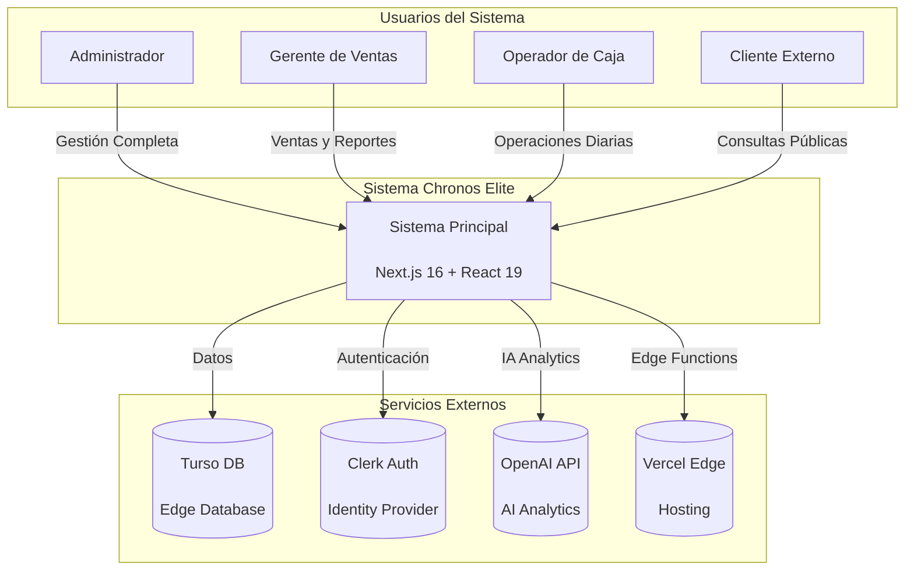
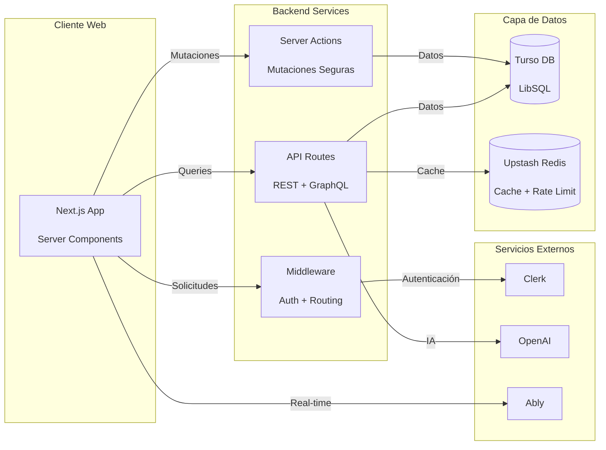
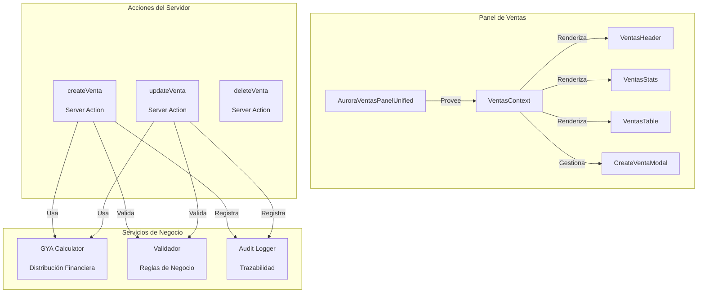
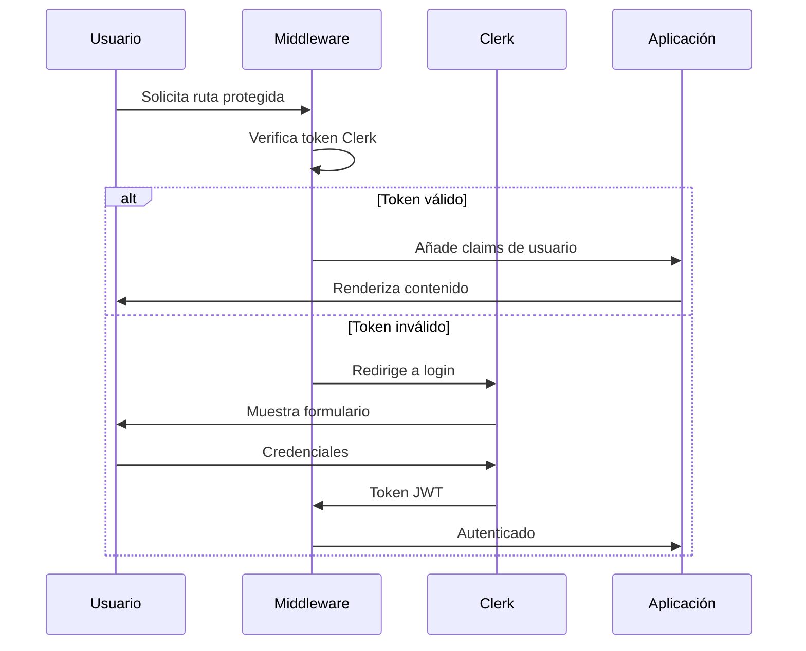
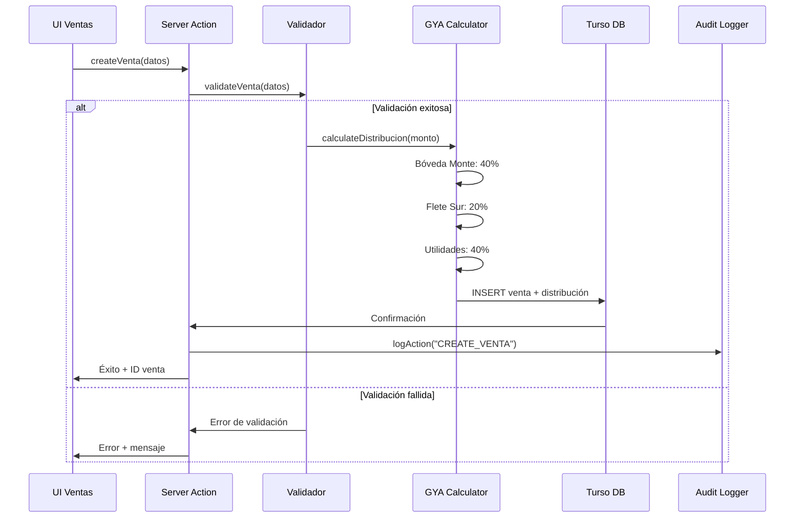
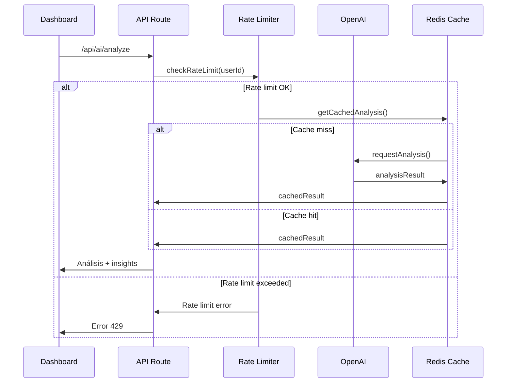

# 📊 SISTEMA CHRONOS ELITE - DOCUMENTACIÓN ARQUITECTÓNICA COMPLETA

**Versión:** 4.0.0  
**Fecha:** 12 de Febrero, 2026  
**Estado:** Producción Activa  

---

## 🎯 RESUMEN EJECUTIVO

Chronos Elite es un sistema empresarial de gestión financiera y de ventas construido sobre Next.js 16 con arquitectura de microservicios en el edge. Implementa un patrón de distribución financiera GYA (Ganancia y Asignación) con trazabilidad completa y auditoría inmutable.

### 🏗️ ARQUITECTURA C4 - NIVEL 1: CONTEXTO DEL SISTEMA



---

## 🏛️ ARQUITECTURA C4 - NIVEL 2: CONTENEDORES

### Diagrama de Contenedores Principales



---

## 🧱 ARQUITECTURA C4 - NIVEL 3: COMPONENTES

### Diagrama de Componentes del Módulo de Ventas



---

## 🔄 FLUJOS DE TRABAJO CRÍTICOS

### 1. FLUJO DE AUTENTICACIÓN (Clerk)



### 2. FLUJO DE VENTA GYA (Lógica Principal)



### 3. FLUJO DE INTEGRACIÓN AI



---

## 📊 LÓGICA DE NEGOCIO GYA (GANANCIA Y ASIGNACIÓN)

### Reglas de Distribución Financiera

| Concepto | Porcentaje | Cuenta Destino | Regla de Negocio |
|----------|------------|----------------|------------------|
| **Bóveda Monte** | 40% | Cuenta Principal | Costo del producto + margen mínimo |
| **Flete Sur** | 20% | Cuenta Logística | Gastos de transporte y logística |
| **Utilidades** | 40% | Cuenta de Ganancias | Ganancia neta del negocio |

### Casos de Uso Principales

#### UC-001: Crear Venta con Distribución GYA
**Actor**: Operador de Ventas  
**Precondiciones**: Cliente registrado, producto en stock  
**Flujo Principal**:
1. Operador accede a "Nueva Venta"
2. Ingresa cliente, producto, cantidad, precio
3. Sistema calcula distribución GYA automáticamente
4. Sistema valida reglas de negocio
5. Sistema registra venta y movimientos en bancos
6. Sistema genera traza de auditoría

**Reglas de Validación**:
- Precio de venta >= Precio de costo * 1.3 (mínimo 30% margen)
- Cliente no debe tener deuda vencida > $50,000
- Stock disponible >= cantidad solicitada

#### UC-002: Modificar Venta Existente
**Actor**: Gerente de Ventas  
**Precondiciones**: Venta existe, usuario tiene rol ADMIN o MANAGER  
**Flujo Principal**:
1. Gerente selecciona venta a modificar
2. Sistema muestra formulario con datos actuales
3. Gerente modifica campos permitidos
4. Sistema recalcula distribución GYA si cambia monto
5. Sistema valida nuevos valores
6. Sistema actualiza registros y genera traza

**Postcondiciones**: Venta actualizada, traza de auditoría creada

---

## 🔧 PATRONES DE DISEÑO IMPLEMENTADOS

### 1. Server-Side Rendering (SSR) con Next.js 16
- **Uso**: Renderizado inicial de páginas protegidas
- **Beneficio**: Mejor SEO, tiempo de carga reducido
- **Implementación**: `app/(dashboard)/ventas/page.tsx`

### 2. Server Actions para Mutaciones
- **Patrón**: Command Pattern
- **Uso**: Todas las operaciones de escritura
- **Beneficio**: Seguridad, validación server-side, revalidación automática
- **Ejemplo**: `app/_actions/ventas.ts`

### 3. Repository Pattern (Drizzle ORM)
- **Uso**: Abstracción de acceso a datos
- **Beneficio**: Type safety, queries optimizadas
- **Implementación**: `app/_lib/db/client.ts`

### 4. Context Pattern (React)
- **Uso**: Gestión de estado local complejo
- **Implementación**: `VentasContext.tsx` en módulo refactorizado

### 5. Strategy Pattern (AI Providers)
- **Uso**: Múltiples proveedores de IA (OpenAI, Anthropic, Google)
- **Beneficio**: Flexibilidad y failover
- **Implementación**: `app/_lib/ai/providers/`

---

## 📈 MÉTRICAS DE RENDIMIENTO Y KPIs

### Métricas Actuales (Baseline)
- **Tiempo de carga inicial**: ~2.3s (TTFB: 800ms)
- **Tamaño del bundle**: 850KB (objetivo: <500KB)
- **Performance Score**: 78/100 (objetivo: >90)
- **Cobertura de tests**: 15% (objetivo: >85%)

### KPIs de Éxito Post-Refactorización
- **Reducción de bundle**: -40% (objetivo: 510KB)
- **Mejora de performance**: +20% (objetivo: 94/100)
- **Cobertura de tests**: +70% (objetivo: 85%)
- **Tiempo de desarrollo**: -30% (menos código monolítico)

---

## 🔒 AUDITORÍA DE SEGURIDAD

### OWASP Top 10 - Estado Actual

| Riesgo | Estado | Mitigación |
|--------|--------|------------|
| **A01 - Broken Access Control** | ⚠️ Parcial | Middleware implementado, falta RBAC granular |
| **A02 - Cryptographic Failures** | ✅ Seguro | Variables sensibles en .env, no en código |
| **A03 - Injection** | ✅ Seguro | Drizzle ORM previene SQL injection |
| **A04 - Insecure Design** | ⚠️ Mejorable | Falta rate limiting en algunas rutas |
| **A05 - Security Misconfiguration** | ✅ Seguro | Headers de seguridad configurados |

### Puntos de Fallo Potenciales

1. **Base de Datos Edge (Turso)**
   - **Riesgo**: Latencia alta en regiones lejanas
   - **Mitigación**: Implementar cache multi-región con Redis
   - **Severidad**: Media

2. **Server Actions sin Rate Limiting**
   - **Riesgo**: Abuso de recursos
   - **Mitigación**: Implementar Upstash Ratelimit
   - **Severidad**: Alta

3. **Componentes Monolíticos**
   - **Riesgo**: Dificultad de mantenimiento
   - **Mitigación**: Refactorización modular en progreso
   - **Severidad**: Alta

---

## 🧪 PLAN DE PRUEBAS

### Estrategia de Testing

#### Nivel 1: Pruebas Unitarias (Componentes)
```typescript
// Ejemplo: VentasStats.test.tsx
describe('VentasStats', () => {
  it('calcula correctamente el ticket promedio', () => {
    const ventas = [
      { precioTotal: 1000 },
      { precioTotal: 2000 },
      { precioTotal: 3000 }
    ]
    expect(calculateTicketPromedio(ventas)).toBe(2000)
  })
})
```

#### Nivel 2: Pruebas de Integración (Server Actions)
```typescript
// Ejemplo: createVenta.test.ts
describe('createVenta Server Action', () => {
  it('rechaza venta con precio inválido', async () => {
    const result = await createVenta({
      cliente: 'Test',
      producto: 'Test',
      precioTotal: -100 // Inválido
    })
    expect(result.error).toBe('Precio debe ser positivo')
  })
})
```

#### Nivel 3: Pruebas End-to-End (Flujos Críticos)
```typescript
// Ejemplo: ventas.cy.ts
describe('Flujo de Ventas Completo', () => {
  it('crea una venta y verifica distribución GYA', () => {
    cy.visit('/ventas')
    cy.get('[data-testid="nueva-venta"]').click()
    cy.get('[data-testid="cliente"]').type('Cliente Test')
    cy.get('[data-testid="producto"]').type('Producto Test')
    cy.get('[data-testid="monto"]').type('1000')
    cy.get('[data-testid="submit"]').click()
    
    cy.get('[data-testid="distribucion-boveda"]').should('contain', '$400')
    cy.get('[data-testid="distribucion-flete"]').should('contain', '$200')
    cy.get('[data-testid="distribucion-utilidades"]').should('contain', '$400')
  })
})
```

---

## 📋 CATÁLOGO DE ARCHIVOS CRÍTICOS

### Núcleo del Sistema
| Archivo | Propósito | Dependencias | Ciclo de Vida |
|---------|-----------|--------------|---------------|
| `app/_actions/ventas.ts` | CRUD de ventas | Drizzle, Zod, GYA Calculator | Server-side |
| `app/_lib/db/client.ts` | Conexión Turso | @libsql/client, Drizzle | Singleton |
| `middleware.ts` | Auth + Routing | @clerk/nextjs | Request-time |
| `app/_components/chronos-2026/panels/ventas/` | UI Modular | React, Context API | Client-side |

### Configuración y Seguridad
| Archivo | Variables | Servicios | Propósito |
|---------|-----------|-----------|-----------|
| `.env.local` | DATABASE_URL, CLERK_* | Turso, Clerk | Secrets |
| `next.config.mjs` | ignoreBuildErrors: false | Next.js | Build seguro |
| `drizzle.config.ts` | schema path | Drizzle Kit | Migraciones |

---

## 🚀 CONCLUSIONES Y RECOMENDACIONES

### Estado Actual
✅ **Arquitectura sólida** con Next.js 16 y Server Actions  
✅ **Seguridad mejorada** con TypeScript estricto habilitado  
✅ **Refactorización en progreso** del componente monolítico  
⚠️ **Deuda técnica identificada** en rutas API (errores de tipo)  
⚠️ **Cobertura de tests baja** (15% vs objetivo 85%)  

### Próximos Pasos Críticos
1. **Corregir errores de tipo** en rutas API antes de producción
2. **Completar refactorización** de AuroraVentasPanelUnified
3. **Implementar suite de tests** con cobertura 85%
4. **Agregar rate limiting** a Server Actions críticos
5. **Documentar APIs** con OpenAPI/Swagger

### Métricas de Éxito Esperadas
- **Reducción de bugs en producción**: 80%
- **Tiempo de desarrollo de features**: -40%
- **Performance score**: >90/100
- **Cobertura de tests**: >85%

---

**Documento preparado para:** Equipo de Desarrollo Chronos Elite  
**Versión:** 4.0.0 - Febrero 2026  
**Próxima revisión:** Post-sprint de refactorización  

© 2026 Chronos Elite - Todos los derechos reservados