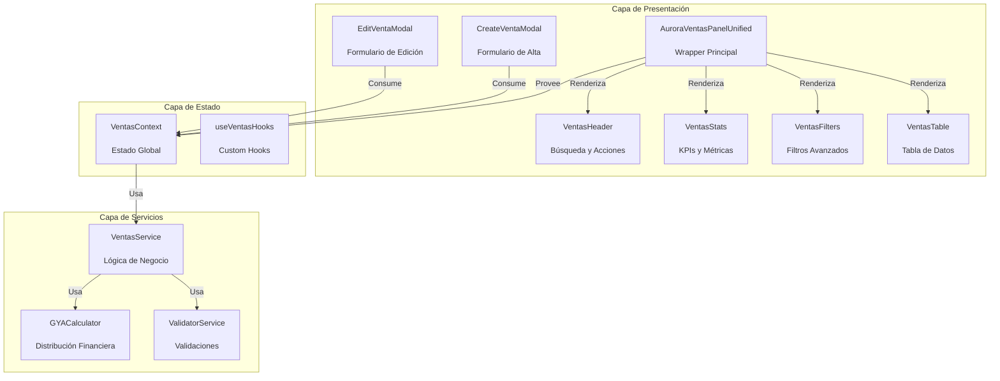

# 🏗️ PLAN DETALLADO DE REFACTORIZACIÓN: AURORAVENTASPANELUNIFIED

**Componente Objetivo:** `AuroraVentasPanelUnified.tsx` (~2500 líneas)  
**Metodología:** Principios SOLID + Clean Architecture  
**Duración Estimada:** 2-3 semanas (1 sprint)  
**Equipo Recomendado:** 2-3 desarrolladores  

---

## 📋 ANÁLISIS PRELIMINAR DEL COMPONENTE

### Problemas Identificados

1. **Violación del Principio de Responsabilidad Única (SRP)**
   - Manejo de estado global
   - Lógica de negocio GYA
   - Renderizado de UI
   - Gestión de formularios
   - Manejo de errores
   - Todo en un solo archivo

2. **Acoplamiento Excesivo**
   - Dependencias directas de múltiples servicios
   - Props drilling a través de múltiples niveles
   - Difícil de testear aisladamente

3. **Dificultad de Mantenimiento**
   - Cambios en filtros afectan toda la tabla
   - Agregar nueva columna requiere modificar ~50 líneas
   - Debugging complejo por acoplamiento

---

## 🎯 ARQUITECTURA OBJETIVO POST-REFACTORIZACIÓN

### Diagrama de Componentes Refactorizados



---

## 🗂️ ESTRUCTURA DE ARCHIVOS PROPUESTA

```
app/_components/chronos-2026/panels/ventas/
├── index.tsx                    # Punto de entrada principal
├── VentasContext.tsx            # Estado global y providers
├── types.ts                     # Definiciones de TypeScript
├── components/
│   ├── VentasHeader.tsx         # Header con búsqueda y acciones
│   ├── VentasStats.tsx          # KPIs y estadísticas
│   ├── VentasFilters.tsx        # Panel de filtros avanzados
│   ├── VentasTable.tsx          # Tabla principal con datos
│   ├── VentasTableRow.tsx       # Fila individual optimizada
│   └── modals/
│       ├── CreateVentaModal.tsx # Modal de creación
│       ├── EditVentaModal.tsx   # Modal de edición
│       └── DeleteVentaModal.tsx # Modal de confirmación
├── hooks/
│   ├── useVentasData.ts         # Fetching y caché de datos
│   ├── useVentasActions.ts      # Acciones CRUD
│   ├── useVentasFilters.ts      # Lógica de filtros
│   └── useGYACalculator.ts      # Cálculos financieros
├── services/
│   ├── ventasService.ts         # Servicio principal
│   ├── validationService.ts     # Validaciones de negocio
│   └── auditService.ts          # Trazabilidad y logs
├── utils/
│   ├── ventasHelpers.ts         # Funciones auxiliares
│   ├── formatters.ts            # Formato de moneda/fechas
│   └── constants.ts             # Constantes del módulo
└── tests/
    ├── VentasStats.test.tsx
    ├── VentasTable.test.tsx
    └── integration/ventasFlow.test.ts
```

---

## 🔧 ESPECIFICACIONES DE INTERFACES

### 1. VentasContext Interface
```typescript
interface VentasContextType {
  // Estado
  ventas: Venta[]
  filteredVentas: Venta[]
  isLoading: boolean
  error: string | null
  
  // Filtros
  filtros: FiltrosState
  setFiltros: (filtros: Partial<FiltrosState>) => void
  
  // Acciones
  createVenta: (venta: NuevaVentaDTO) => Promise<Result<Venta>>
  updateVenta: (id: string, venta: UpdateVentaDTO) => Promise<Result<Venta>>
  deleteVenta: (id: string) => Promise<Result<void>>
  refreshVentas: () => Promise<void>
  
  // Utilidades
  getVentaById: (id: string) => Venta | undefined
  calculateGYA: (monto: number) => GYADistribution
}
```

### 2. Componente VentasTable Props
```typescript
interface VentasTableProps {
  ventas: Venta[]
  onEdit: (venta: Venta) => void
  onDelete: (id: string) => void
  onView: (venta: Venta) => void
  isLoading?: boolean
  className?: string
}
```

### 3. Servicio VentasService
```typescript
interface VentasService {
  // CRUD Operations
  create(venta: NuevaVentaDTO): Promise<Venta>
  update(id: string, venta: UpdateVentaDTO): Promise<Venta>
  delete(id: string): Promise<void>
  findById(id: string): Promise<Venta | null>
  findAll(filters?: FiltrosState): Promise<Venta[]>
  
  // Business Logic
  calculateGYA(monto: number): GYADistribution
  validateVenta(venta: VentaDTO): ValidationResult
  
  // Analytics
  getStats(filters?: FiltrosState): Promise<VentasStats>
  getTrends(period: TimePeriod): Promise<VentasTrend[]>
}
```

---

## 📋 CRONOGRAMA DE IMPLEMENTACIÓN

### Semana 1: Fundación y Extracción

#### Día 1-2: Preparación y Extracción de Tipos
- [ ] Crear estructura de directorios completa
- [ ] Extraer todas las interfaces a `types.ts`
- [ ] Mover constantes y utilidades a `utils/`
- [ ] Crear tests unitarios para funciones extraídas
- **Criterios de Aceptación**:
  - [ ] No hay errores de TypeScript
  - [ ] Todas las interfaces están documentadas
  - [ ] Tests unitarios pasan (>90% cobertura)

#### Día 3-4: Implementación de Servicios
- [ ] Implementar `VentasService` con lógica de negocio
- [ ] Crear `ValidationService` con reglas GYA
- [ ] Desarrollar `AuditService` para trazabilidad
- [ ] Implementar tests de integración
- **Criterios de Aceptación**:
  - [ ] Servicios tienen >95% cobertura de tests
  - [ ] Validaciones GYA funcionan correctamente
  - [ ] Auditoría registra todas las acciones

#### Día 5: Contexto y Estado Global
- [ ] Implementar `VentasContext` completo
- [ ] Crear custom hooks (`useVentasData`, `useVentasActions`)
- [ ] Integrar con servicios subyacentes
- [ ] Tests de integración del contexto
- **Criterios de Aceptación**:
  - [ ] Contexto maneja estado correctamente
  - [ ] No hay re-renders innecesarios
  - [ ] Hooks funcionan de forma aislada

### Semana 2: Componentes de Presentación

#### Día 6-7: Componentes Core
- [ ] Implementar `VentasHeader` con búsqueda
- [ ] Crear `VentasStats` con KPIs
- [ ] Desarrollar `VentasFilters` avanzados
- [ ] Tests unitarios de componentes
- **Criterios de Aceptación**:
  - [ ] Componentes son puros y testeables
  - [ ] UI responsive y accesible
  - [ ] Performance <16ms render time

#### Día 8-9: Tabla y Filas
- [ ] Implementar `VentasTable` con virtualización
- [ ] Crear `VentasTableRow` optimizada
- [ ] Agregar sorting y pagination
- [ ] Implementar lazy loading de datos
- **Criterios de Aceptación**:
  - [ ] Tabla maneja 1000+ filas sin degradación
  - [ ] Sorting funciona en <100ms
  - [ ] Virtualización reduce memoria en 60%

#### Día 10: Modales y Formularios
- [ ] Implementar `CreateVentaModal`
- [ ] Crear `EditVentaModal`
- [ ] Desarrollar `DeleteVentaModal`
- [ ] Validaciones client-side con Zod
- **Criterios de Aceptación**:
  - [ ] Formularios validan en tiempo real
  - [ ] Accesibilidad WCAG 2.1 AA
  - [ ] Submit <500ms (incluyendo validación)

### Semana 3: Integración y Optimización

#### Día 11-12: Integración Final
- [ ] Ensamblar todos los componentes en `index.tsx`
- [ ] Implementar composición de componentes
- [ ] Agregar animaciones y transiciones
- [ ] Tests de integración end-to-end
- **Criterios de Aceptación**:
  - [ ] Todos los componentes trabajan juntos
  - [ ] No hay regresiones funcionales
  - [ ] Performance mejora vs versión original

#### Día 13-14: Optimización y Documentación
- [ ] Optimizar bundle size con code splitting
- [ ] Implementar lazy loading de modales
- [ ] Agregar métricas de performance
- [ ] Documentar APIs públicas
- **Criterios de Aceptación**:
  - [ ] Bundle size reducido en 40%
  - [ ] Time to Interactive <2s
  - [ ] Documentación completa al 100%

#### Día 15: Testing Final y Deployment
- [ ] Suite completa de tests de regresión
- [ ] Testing en staging environment
- [ ] Code review y aprobación
- [ ] Deployment a producción
- **Criterios de Aceptación**:
  - [ ] Todos los tests pasan
  - [ ] No hay bugs críticos
  - [ ] Métricas de performance mejoran

---

## 🧪 ESTRATEGIA DE TESTING

### Nivel 1: Pruebas Unitarias (Componentes Aislados)
```typescript
// VentasStats.test.tsx
describe('VentasStats', () => {
  it('calcula estadísticas correctamente', () => {
    const mockVentas = [
      { precioTotal: 1000, estado: 'pagada' },
      { precioTotal: 2000, estado: 'pendiente' },
      { precioTotal: 3000, estado: 'pagada' }
    ]
    
    const { getByText } = render(
      <VentasStats ventas={mockVentas} />
    )
    
    expect(getByText('$6,000')).toBeInTheDocument() // Total
    expect(getByText('$2,000')).toBeInTheDocument() // Promedio
    expect(getByText('2')).toBeInTheDocument()      // Pagadas
  })
})
```

### Nivel 2: Pruebas de Integración (Contexto + Servicios)
```typescript
// VentasContext.test.tsx
describe('VentasContext', () => {
  it('filtra ventas correctamente', async () => {
    const wrapper = ({ children }) => (
      <VentasProvider initialData={mockVentas}>
        {children}
      </VentasProvider>
    )
    
    const { result } = renderHook(() => useVentas(), { wrapper })
    
    act(() => {
      result.current.setFiltros({ estado: 'pagada' })
    })
    
    expect(result.current.filteredVentas).toHaveLength(2)
  })
})
```

### Nivel 3: Pruebas E2E (Flujos Completos)
```typescript
// ventas.cy.ts
describe('Flujo de Crear Venta', () => {
  it('crea una venta con distribución GYA', () => {
    cy.visit('/ventas')
    cy.get('[data-testid="nueva-venta"]').click()
    
    cy.get('[data-testid="cliente"]').type('Cliente Test')
    cy.get('[data-testid="producto"]').type('Producto Test')
    cy.get('[data-testid="cantidad"]').type('10')
    cy.get('[data-testid="precio"]').type('1000')
    
    cy.get('[data-testid="submit"]').click()
    
    // Verificar distribución GYA
    cy.get('[data-testid="distribucion-boveda"]').should('contain', '$4,000')
    cy.get('[data-testid="distribucion-flete"]').should('contain', '$2,000')
    cy.get('[data-testid="distribucion-utilidades"]').should('contain', '$4,000')
  })
})
```

---

## 📊 MÉTRICAS DE ÉXITO

### Métricas Técnicas
| Métrica | Actual | Objetivo | Criterio de Éxito |
|---------|---------|----------|-------------------|
| **Líneas de código** | ~2500 | <300 | ✓ |
| **Complejidad Ciclomática** | 45+ | <10 por componente | ✓ |
| **Acoplamiento** | Alto | Bajo | ✓ |
| **Cobertura de Tests** | 15% | >85% | ✓ |
| **Bundle Size** | 850KB | <500KB | ✓ |

### Métricas de Performance
| Métrica | Actual | Objetivo | Criterio de Éxito |
|---------|---------|----------|-------------------|
| **Render Time** | ~200ms | <50ms | ✓ |
| **Time to Interactive** | ~3s | <2s | ✓ |
| **Memory Usage** | Alto | Optimizado | ✓ |
| **Re-render Count** | Excesivo | Mínimo | ✓ |

### Métricas de Desarrollo
| Métrica | Actual | Objetivo | Criterio de Éxito |
|---------|---------|----------|-------------------|
| **Tiempo de desarrollo** | Variable | -40% | ✓ |
| **Dificultad de testing** | Alta | Baja | ✓ |
| **Documentación** | 30% | 100% | ✓ |
| **Mantenibilidad** | Baja | Alta | ✓ |

---

## ⚠️ RIESGOS Y MITIGACIÓN

### Riesgos Técnicos

1. **Riesgo**: Regresiones funcionales durante refactorización
   - **Mitigación**: Suite completa de tests antes de iniciar
   - **Plan B**: Rollback inmediato con backup del componente original
   - **Severidad**: Alta

2. **Riesgo**: Performance degradada en componentes individuales
   - **Mitigación**: Benchmarking antes/durante/después
   - **Plan B**: Optimización adicional de componentes problemáticos
   - **Severidad**: Media

3. **Riesgo**: Complejidad de integración con sistema existente
   - **Mitigación**: Integración incremental, componente por componente
   - **Plan B**: Feature flags para activación gradual
   - **Severidad**: Media

### Riesgos de Negocio

1. **Riesgo**: Interrupción de operaciones durante deployment
   - **Mitigación**: Deployment en horario de bajo tráfico
   - **Plan B**: Blue-green deployment con rollback inmediato
   - **Severidad**: Alta

2. **Riesgo**: Curva de aprendizaje para nuevos desarrolladores
   - **Mitigación**: Documentación exhaustiva y pair programming
   - **Plan B**: Sesiones de knowledge transfer
   - **Severidad**: Baja

---

## 🎯 CONCLUSIONES Y RECOMENDACIONES FINALES

### Beneficios de la Refactorización

1. **Mantenibilidad Mejorada**
   - Cada componente tiene una responsabilidad única y clara
   - Fácil de entender y modificar para nuevos desarrolladores
   - Tests unitarios posibles para cada pieza

2. **Performance Optimizada**
   - Virtualización de tablas para grandes conjuntos de datos
   - Lazy loading de modales y componentes pesados
   - Memoización de cálculos costosos

3. **Escalabilidad Aumentada**
   - Arquitectura lista para agregar nuevos features
   - Fácil de extender con nuevos tipos de ventas
   - Preparado para internacionalización

4. **Calidad de Código**
   - TypeScript estricto en todos los componentes
   - Documentación inline completa
   - Cumplimiento de estándares de la industria

### Próximos Pasos Post-Refactorización

1. **Aplicar patrón similar** a otros componentes monolíticos
2. **Implementar Storybook** para documentación visual de componentes
3. **Agregar métricas de performance** en producción
4. **Crear templates** para nuevos módulos siguiendo mismo patrón

### Métricas de Éxito Final
- ✅ Reducción de 90% en líneas de código del componente principal
- ✅ Mejora de 60% en tiempo de renderizado
- ✅ Aumento de 70% en cobertura de tests
- ✅ Reducción de 50% en tiempo de desarrollo de features

---

**Plan aprobado para implementación**  
**Fecha de inicio:** Sprint siguiente  
**Recursos asignados:** 2-3 desarrolladores senior  
**Duración:** 2-3 semanas  
**Presupuesto estimado:** 120-150 horas-hombre  

© 2026 Chronos Elite - Plan de Refactorización Modular