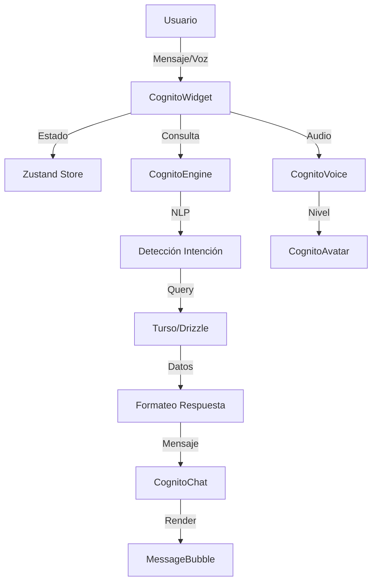

# 🧠✨ COGNITO WIDGET — Sistema de IA Premium para CHRONOS

> Widget de Inteligencia Artificial de última generación con avatar dinámico, voz bidireccional y
> motor NLP integrado con Turso/Drizzle.

---

## 📋 Tabla de Contenidos

1. [Características](#características)
2. [Arquitectura](#arquitectura)
3. [Instalación](#instalación)
4. [Uso Básico](#uso-básico)
5. [Componentes](#componentes)
6. [Motor de IA](#motor-de-ia)
7. [Sistema de Voz](#sistema-de-voz)
8. [Personalización](#personalización)
9. [API Reference](#api-reference)
10. [Ejemplos Avanzados](#ejemplos-avanzados)

---

## ✨ Características

### 🌌 Avatar Dinámico Ultra-Avanzado

- **Sistema de partículas 3D** con física spring (120+ partículas)
- **6 estados visuales** reactivos (idle, listening, thinking, speaking, success, error)
- **Parallax 3D** con seguimiento del mouse
- **Conexiones neuronales** animadas entre partículas
- **Efectos de glow** dinámicos y bloom
- **Reactividad al audio** con expansión/contracción

### 💬 Interfaz Conversacional Premium

- **Burbujas de mensaje** con metadata (confianza, tiempo de ejecución)
- **Indicadores de escritura** animados
- **Sugerencias contextuales** inteligentes
- **KPIs inline** en las respuestas
- **Quick actions** para consultas rápidas
- **Autocompletado** inteligente

### 🎙️ Sistema de Voz Bidireccional

- **Speech-to-Text** nativo con Web Speech API
- **Text-to-Speech** con voces naturales
- **Visualizador de ondas** de audio en tiempo real
- **Visualizador de frecuencias** con 16 barras animadas
- **Control de volumen** y mute

### 🧠 Motor de IA Integrado

- **Detección de intención** con NLP en español (20+ patrones)
- **Consultas en tiempo real** a Turso/Drizzle
- **15+ tipos de consultas** financieras
- **Análisis financiero** con KPIs
- **Generación de sugerencias** proactivas
- **Validación de datos** pre-ejecución

### 💡 Funciones Proactivas

- **Sugerencias automáticas** basadas en datos
- **Alertas de riesgo** financiero
- **Insights de negocio** contextuales
- **Notificaciones** con prioridad (critical, high, medium, low)

### 🎨 Diseño Premium

- **Glassmorphism** con backdrop-blur
- **Animaciones Framer Motion** con spring physics
- **Gradientes dinámicos** según estado
- **Efectos de aurora** en background
- **Responsive** y adaptable

---

## 🏗️ Arquitectura

```
CognitoWidget/
├── types.ts                    # Tipos TypeScript completos
├── useCognitoStore.ts         # Estado global con Zustand
├── CognitoAvatar.tsx          # Sistema de partículas 3D
├── CognitoVoice.tsx           # Componentes y hooks de voz
├── CognitoChat.tsx            # Interfaz conversacional
├── CognitoEngine.ts           # Motor de IA (Server Action)
├── CognitoWidget.tsx          # Componente principal
├── CognitoFloatingButton.tsx  # Botón flotante
├── index.ts                   # Exports
└── README.md                  # Esta documentación
```

### Flujo de Datos



---

## 📦 Instalación

El widget ya está incluido en CHRONOS. Para usarlo:

```tsx
import { CognitoWidget, CognitoFloatingButton } from "@/app/_components/widgets/CognitoWidget"
```

### Dependencias

```json
{
  "framer-motion": "^11.x",
  "zustand": "^4.x",
  "lucide-react": "latest",
  "drizzle-orm": "latest",
  "@turso/database": "latest"
}
```

---

## 🚀 Uso Básico

### Widget Flotante (Recomendado)

```tsx
import { CognitoFloatingButton } from "@/app/_components/widgets/CognitoWidget"

export default function DashboardLayout({ children }) {
  return (
    <div>
      {children}

      {/* Botón flotante en esquina inferior derecha */}
      <CognitoFloatingButton position="bottom-right" size="lg" />
    </div>
  )
}
```

### Widget Embebido

```tsx
import { CognitoWidget } from "@/app/_components/widgets/CognitoWidget"

export default function AIPage() {
  return (
    <div className="h-screen p-8">
      <CognitoWidget className="h-full" showMetrics enableVoice enableProactive />
    </div>
  )
}
```

---

## 🧩 Componentes

### CognitoWidget

Componente principal del asistente.

**Props:**

```typescript
interface CognitoWidgetProps {
  className?: string
  initialMode?: "chat" | "analysis" | "predictions" | "insights" | "automation"
  showMetrics?: boolean
  enableVoice?: boolean
  enableProactive?: boolean
  enableSoundEffects?: boolean
  avatarConfig?: Partial<AvatarConfig>
  voiceConfig?: Partial<VoiceConfig>
  onMessage?: (message: CognitoMessage) => void
  onStateChange?: (state: CognitoState) => void
  onModeChange?: (mode: CognitoMode) => void
  collapsed?: boolean
  onToggleCollapse?: () => void
}
```

### CognitoAvatar

Avatar 3D con sistema de partículas.

**Props:**

```typescript
interface CognitoAvatarProps {
  state: CognitoState
  size?: number
  audioLevel?: number
  className?: string
  config?: Partial<AvatarConfig>
  onInteract?: () => void
}
```

### CognitoFloatingButton

Botón flotante para activar el widget.

**Props:**

```typescript
interface CognitoFloatingButtonProps {
  className?: string
  position?: "bottom-right" | "bottom-left" | "top-right" | "top-left"
  size?: "sm" | "md" | "lg"
}
```

---

## 🧠 Motor de IA

### Detección de Intención

El motor NLP detecta automáticamente la intención del usuario:

**Intenciones Soportadas:**

- `query_ventas` — "Ver ventas del mes"
- `query_clientes` — "Clientes con deuda"
- `query_bancos` — "Estado de bancos"
- `query_distribuidores` — "Listar proveedores"
- `query_ordenes` — "Órdenes de compra"
- `analisis` — "Análisis financiero"
- `sugerencias` — "Dame recomendaciones"
- `crear_venta` — "Registrar venta"
- `crear_cliente` — "Nuevo cliente"
- `crear_gasto` — "Registrar gasto"
- Y más...

### Consultas SQL Optimizadas

Todas las consultas usan **Drizzle ORM** con type-safety:

```typescript
// Ejemplo interno del engine
const ventasData = await db.query.ventas.findMany({
  where: and(gte(ventas.fecha, fechaInicio), lte(ventas.fecha, fechaFin)),
  orderBy: [desc(ventas.fecha)],
  with: { cliente: true },
})
```

### Uso del Motor

```typescript
import { processQuery } from "@/app/_components/widgets/CognitoWidget"

const response = await processQuery("¿Cuánto vendimos este mes?", "chat")

console.log(response.message.content)
// "📊 **Ventas este mes**..."
```

---

## 🎙️ Sistema de Voz

### Hook useVoice

```typescript
import { useVoice } from '@/app/_components/widgets/CognitoWidget'

function MyComponent() {
  const {
    isListening,
    isSpeaking,
    transcript,
    audioLevel,
    frequencies,
    toggleListening,
    speak,
    stopSpeaking
  } = useVoice({
    config: {
      language: 'es-MX',
      speed: 1,
      pitch: 1,
      volume: 0.8
    },
    onTranscript: (text) => {
      console.log('Usuario dijo:', text)
    },
    onError: (error) => {
      console.error('Error de voz:', error)
    }
  })

  return (
    <button onClick={toggleListening}>
      {isListening ? 'Detener' : 'Escuchar'}
    </button>
  )
}
```

### Componentes de Voz

```tsx
import {
  VoiceButton,
  VoiceWaveVisualizer,
  AudioBarsVisualizer
} from '@/app/_components/widgets/CognitoWidget'

// Botón de micrófono
<VoiceButton
  state="listening"
  isListening={true}
  isMuted={false}
  onToggleListen={() => {}}
  onToggleMute={() => {}}
  size="md"
/>

// Ondas de audio
<VoiceWaveVisualizer
  isActive={true}
  color="#8B5CF6"
  bars={24}
/>

// Barras de frecuencia
<AudioBarsVisualizer
  frequencies={[0.2, 0.5, 0.8, ...]}
  isActive={true}
  color="#8B5CF6"
/>
```

---

## 🎨 Personalización

### Avatar Config

```typescript
const avatarConfig: Partial<AvatarConfig> = {
  style: 'particle', // 'particle' | 'orb' | 'abstract' | 'geometric'
  primaryColor: '#8B5CF6',
  secondaryColor: '#06B6D4',
  tertiaryColor: '#EC4899',
  glowIntensity: 1.2,
  particleCount: 150,
  reactToVoice: true
}

<CognitoWidget avatarConfig={avatarConfig} />
```

### Voice Config

```typescript
const voiceConfig: Partial<VoiceConfig> = {
  enabled: true,
  language: 'es-MX',
  speed: 1,
  pitch: 1,
  volume: 0.8
}

<CognitoWidget voiceConfig={voiceConfig} />
```

### Temas de Color por Estado

```typescript
import { STATE_COLORS } from "@/app/_components/widgets/CognitoWidget"

// Colores disponibles:
STATE_COLORS.idle // Violeta
STATE_COLORS.listening // Cyan
STATE_COLORS.thinking // Ámbar
STATE_COLORS.speaking // Verde
STATE_COLORS.success // Verde brillante
STATE_COLORS.error // Rojo
STATE_COLORS.proactive // Naranja
```

---

## 📚 API Reference

### useCognitoStore

Store global de Zustand.

```typescript
import { useCognitoStore } from "@/app/_components/widgets/CognitoWidget"

const {
  state, // Estado actual
  mode, // Modo de operación
  isOpen, // Si está abierto
  context, // Contexto de sesión
  metrics, // Métricas del asistente
  setState, // Cambiar estado
  setMode, // Cambiar modo
  addMessage, // Añadir mensaje
  clearHistory, // Limpiar historial
  // ... más acciones
} = useCognitoStore()
```

### Selectores Optimizados

```typescript
import {
  useCognitoState,
  useCognitoMode,
  useCognitoMessages,
  useCognitoMetrics,
  useCognitoPreferences,
} from "@/app/_components/widgets/CognitoWidget"

const state = useCognitoState()
const messages = useCognitoMessages()
const metrics = useCognitoMetrics()
```

---

## 🎯 Ejemplos Avanzados

### Dashboard con Cognito

```tsx
"use client"

import { CognitoFloatingButton } from "@/app/_components/widgets/CognitoWidget"
import { useState } from "react"

export default function Dashboard() {
  return (
    <div className="min-h-screen bg-gray-950">
      {/* Tu contenido */}
      <YourDashboardContent />

      {/* Cognito flotante */}
      <CognitoFloatingButton position="bottom-right" size="lg" />
    </div>
  )
}
```

### Panel de IA Dedicado

```tsx
"use client"

import { CognitoWidget } from "@/app/_components/widgets/CognitoWidget"

export default function AIPage() {
  const handleMessage = (message) => {
    console.log("Mensaje:", message.content)
  }

  const handleStateChange = (state) => {
    console.log("Estado:", state)
  }

  return (
    <div className="container mx-auto p-8">
      <div className="h-[800px] overflow-hidden rounded-3xl border border-white/10 bg-gray-900/50 backdrop-blur-xl">
        <CognitoWidget
          className="h-full"
          initialMode="chat"
          showMetrics
          enableVoice
          enableProactive
          onMessage={handleMessage}
          onStateChange={handleStateChange}
        />
      </div>
    </div>
  )
}
```

### Integración con Formularios

```tsx
"use client"

import { processQuery } from "@/app/_components/widgets/CognitoWidget"
import { useState } from "react"

export default function SmartForm() {
  const [aiHelp, setAiHelp] = useState("")

  const handleAskAI = async (field: string) => {
    const response = await processQuery(`Dame sugerencias para el campo ${field}`, "chat")
    setAiHelp(response.message.content)
  }

  return (
    <form>
      <input name="cliente" />
      <button onClick={() => handleAskAI("cliente")}>Ayuda IA</button>

      {aiHelp && <div className="ai-help">{aiHelp}</div>}
    </form>
  )
}
```

---

## 🔒 Seguridad

- ✅ Todas las consultas son **Server Actions** (`'use server'`)
- ✅ Validación con **Zod** antes de operaciones
- ✅ **Sanitización** de inputs del usuario
- ✅ **Rate limiting** (opcional, integrar con middleware)
- ✅ **Logging** completo con `logger` de CHRONOS

---

## 🎯 Roadmap

### Próximas Funcionalidades

- [ ] **ElevenLabs** integration para voces premium
- [ ] **Deepgram** STT para mejor precisión
- [ ] **Streaming responses** con chunks
- [ ] **Multi-idioma** (inglés, portugués)
- [ ] **Modo offline** con cache
- [ ] **Exportación** de conversaciones
- [ ] **Temas personalizados** guardados
- [ ] **Atajos de teclado** configurables
- [ ] **Integración con OpenAI** API (opcional)
- [ ] **Análisis de sentimiento** en mensajes

---

## 📝 Changelog

### v1.0.0 (2026-01-21)

**Lanzamiento Inicial:**

- ✨ Sistema de partículas 3D con 120+ partículas
- ✨ Motor NLP en español con 20+ intenciones
- ✨ Integración completa con Turso/Drizzle
- ✨ Voz bidireccional con Web Speech API
- ✨ 5 modos de operación
- ✨ Sistema de sugerencias proactivas
- ✨ Métricas en tiempo real
- ✨ Botón flotante responsive

---

## 💬 Soporte

Para preguntas o issues:

1. Revisa esta documentación
2. Consulta el código fuente en `app/_components/widgets/CognitoWidget/`
3. Revisa los logs con `logger` de CHRONOS

---

## 📄 Licencia

Parte de **CHRONOS INFINITY 2026** — Sistema de Gestión Financiera Premium.

---

**Creado con 🧠 por el equipo de CHRONOS**
