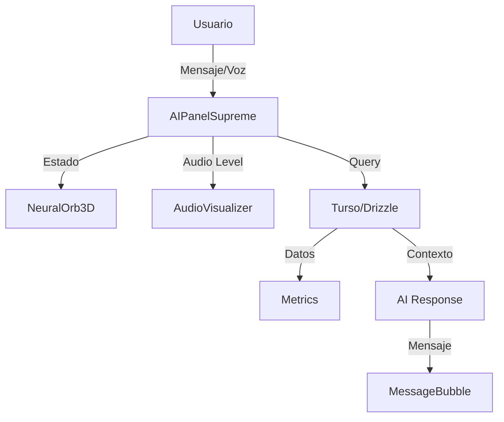

# 🤖 AI Panel Supreme — Documentación Completa

> Panel de IA ultra-avanzado para CHRONOS Elite v3.0.0

---

## 📋 Índice

1. [Overview](#overview)
2. [Características](#características)
3. [Arquitectura](#arquitectura)
4. [Instalación](#instalación)
5. [Uso Básico](#uso-básico)
6. [Props API](#props-api)
7. [Modos de IA](#modos-de-ia)
8. [Neural Orb 3D](#neural-orb-3d)
9. [Sistema de Voz](#sistema-de-voz)
10. [Integración con Datos](#integración-con-datos)
11. [Personalización](#personalización)
12. [Performance](#performance)

---

## Overview

El **AI Panel Supreme** es el componente de IA más avanzado de CHRONOS Elite, integrando:

- **Neural Orb 3D** con Canvas WebGL y física spring
- **4 modos de IA**: Chat, Análisis, Predicciones, Insights
- **Sistema de voz bidireccional** (Speech-to-Text + Text-to-Speech)
- **Visualizador de audio 3D** en tiempo real
- **Métricas interactivas** con datos de Turso/Drizzle
- **Efectos premium**: Aurora, Glassmorphism, Particles

### Stack Tecnológico

| Tecnología          | Uso                                |
| ------------------- | ---------------------------------- |
| **Framer Motion**   | Animaciones spring, gestos, scroll |
| **Canvas API**      | Neural Orb 3D, partículas          |
| **Web Speech API**  | Speech-to-Text, Text-to-Speech     |
| **Turso + Drizzle** | Datos en tiempo real               |
| **Tailwind CSS**    | Estilos premium                    |
| **TypeScript**      | Type-safety completo               |

---

## Características

### ✨ Neural Orb 3D

- **Núcleo dinámico** con gradiente radial
- **50 partículas** orbitando con física
- **Estados visuales** (idle, listening, thinking, responding)
- **Reactividad al mouse** con spring physics
- **Ondas de audio** visualizadas en tiempo real
- **Glow exterior** con blur animado

### 🎙️ Sistema de Voz

- **Speech-to-Text** con Web Speech API
- **Text-to-Speech** con voces naturales
- **Visualizador de audio** con 12 barras animadas
- **Nivel de audio** reflejado en el orbe
- **Controles** dedicados (mic, speaker)

### 🧠 Modos de IA

| Modo             | Color   | Descripción                |
| ---------------- | ------- | -------------------------- |
| **Chat**         | Violeta | Conversación natural       |
| **Análisis**     | Cyan    | Análisis profundo de datos |
| **Predicciones** | Fucsia  | Proyecciones financieras   |
| **Insights**     | Ámbar   | Oportunidades de mejora    |

### 📊 Métricas en Tiempo Real

- **Consultas hoy** con tendencia
- **Precisión** del sistema IA
- **Insights generados** con cambio porcentual
- **Confianza promedio** de respuestas

### 💬 Chat Avanzado

- **Burbujas de mensaje** diferenciadas por rol
- **Metadata** (confianza, datos usados)
- **Timestamps** formateados
- **Auto-scroll** suave
- **Indicadores de estado** (thinking, typing)

---

## Arquitectura

```
AIPanelSupreme/
├── NeuralOrb3D         # Canvas 3D con partículas
├── AudioVisualizer     # Barras de audio animadas
├── MetricsPanel        # Grid de métricas
├── MessageBubble       # Burbujas de chat
└── Main Component      # Orquestador principal
```

### Flujo de Datos



---

## Instalación

El componente ya está incluido en CHRONOS Elite. Para usarlo:

```tsx
import { AIPanelSupreme } from "@/app/_components/panels"
```

### Dependencias (ya instaladas)

```json
{
  "framer-motion": "latest",
  "lucide-react": "latest",
  "drizzle-orm": "latest",
  "@turso/database": "latest"
}
```

---

## Uso Básico

### Ejemplo Mínimo

```tsx
import { AIPanelSupreme } from "@/app/_components/panels"

export default function AIPage() {
  return (
    <div className="h-screen">
      <AIPanelSupreme />
    </div>
  )
}
```

### Ejemplo Completo

```tsx
"use client"

import { AIPanelSupreme } from "@/app/_components/panels"
import { useState } from "react"

export default function AIPage() {
  const [mode, setMode] = useState<"chat" | "analysis" | "predictions" | "insights">("chat")

  return (
    <div className="min-h-screen bg-gray-950 p-8">
      <div className="h-[calc(100vh-4rem)] overflow-hidden rounded-3xl border border-white/10 bg-gray-900/50 backdrop-blur-xl">
        <AIPanelSupreme
          initialMode={mode}
          showMetrics
          enableVoice
          onModeChange={(newMode) => {
            console.log("Modo cambiado:", newMode)
            setMode(newMode)
          }}
          onMessage={(msg) => {
            console.log("Mensaje enviado:", msg)
          }}
        />
      </div>
    </div>
  )
}
```

---

## Props API

### `AIPanelSupremeProps`

| Prop           | Tipo                     | Default  | Descripción                |
| -------------- | ------------------------ | -------- | -------------------------- |
| `className`    | `string`                 | `""`     | Clases CSS adicionales     |
| `initialMode`  | `AIMode`                 | `"chat"` | Modo inicial               |
| `onModeChange` | `(mode: AIMode) => void` | -        | Callback al cambiar modo   |
| `showMetrics`  | `boolean`                | `true`   | Mostrar panel de métricas  |
| `enableVoice`  | `boolean`                | `true`   | Habilitar controles de voz |

### Tipos

```typescript
type AIMode = "chat" | "analysis" | "predictions" | "insights"

type AIState = "idle" | "listening" | "thinking" | "responding" | "success" | "error"

type MessageRole = "user" | "assistant" | "system"

interface Message {
  id: string
  role: MessageRole
  content: string
  timestamp: Date
  metadata?: {
    mode?: AIMode
    dataUsed?: string[]
    confidence?: number
  }
}
```

---

## Modos de IA

### 1. Chat (Conversacional)

**Color**: Violeta (`#8B5CF6`) **Icono**: `MessageSquare` **Uso**: Conversaciones generales,
preguntas rápidas

```tsx
<AIPanelSupreme initialMode="chat" />
```

**Ejemplo de consulta**:

- "¿Cuántas ventas tengo hoy?"
- "Muéstrame el capital de Bóveda Monte"

### 2. Análisis (Datos)

**Color**: Cyan (`#06B6D4`) **Icono**: `ChartBar` **Uso**: Análisis profundo de datos financieros

```tsx
<AIPanelSupreme initialMode="analysis" />
```

**Ejemplo de consulta**:

- "Analiza las tendencias de ventas del último mes"
- "Compara el rendimiento de todos los bancos"

### 3. Predicciones (Proyecciones)

**Color**: Fucsia (`#F472B6`) **Icono**: `TrendingUp` **Uso**: Proyecciones y tendencias futuras

```tsx
<AIPanelSupreme initialMode="predictions" />
```

**Ejemplo de consulta**:

- "Predice las ventas del próximo trimestre"
- "¿Cuándo alcanzaremos $1M en utilidades?"

### 4. Insights (Oportunidades)

**Color**: Ámbar (`#F59E0B`) **Icono**: `Lightbulb` **Uso**: Descubrimiento de oportunidades y
mejoras

```tsx
<AIPanelSupreme initialMode="insights" />
```

**Ejemplo de consulta**:

- "¿Qué áreas necesitan atención?"
- "Sugerencias para optimizar capital"

---

## Neural Orb 3D

### Anatomía del Orb

```
┌─────────────────────┐
│  Glow Exterior      │ ← Blur 3xl, opacity 50%
│  ┌───────────────┐  │
│  │ Ondas Audio   │  │ ← 3 anillos (listening/responding)
│  │ ┌─────────┐   │  │
│  │ │ Núcleo  │   │  │ ← Gradiente radial animado
│  │ │ Central │   │  │
│  │ └─────────┘   │  │
│  │  Partículas   │  │ ← 50 puntos orbitando
│  └───────────────┘  │
└─────────────────────┘
```

### Estados Visuales

| Estado       | Color Primario | Color Secundario | Comportamiento    |
| ------------ | -------------- | ---------------- | ----------------- |
| `idle`       | Violeta        | Lavanda          | Respiración suave |
| `listening`  | Cyan           | Turquesa         | Ondas expansivas  |
| `thinking`   | Ámbar          | Amarillo         | Líneas conectoras |
| `responding` | Verde          | Esmeralda        | Pulsos rápidos    |

### Física de Partículas

```typescript
interface Particle {
  x: number // Posición X
  y: number // Posición Y
  vx: number // Velocidad X
  vy: number // Velocidad Y
  radius: number // Tamaño (1-3px)
  angle: number // Ángulo de órbita
  speed: number // Velocidad angular (0.01-0.03)
  orbitRadius: number // Radio de órbita (40-70px)
  alpha: number // Transparencia (0.5-1)
}
```

### Interactividad Mouse

- **Hover**: Escala 1.05x con spring
- **Movimiento**: Paralaje 3D (factor 0.1)
- **Leave**: Retorno suave al centro

---

## Sistema de Voz

### Speech-to-Text

```typescript
// Web Speech API (nativo en navegadores)
const recognition = new (window.SpeechRecognition || window.webkitSpeechRecognition)()

recognition.lang = "es-MX"
recognition.continuous = false
recognition.interimResults = false

recognition.onresult = (event) => {
  const transcript = event.results[0][0].transcript
  console.log("Transcripción:", transcript)
}

recognition.start()
```

### Text-to-Speech

```typescript
const utterance = new SpeechSynthesisUtterance(text)
utterance.lang = "es-MX"
utterance.rate = 1.0
utterance.pitch = 1.0

window.speechSynthesis.speak(utterance)
```

### Audio Visualizer

12 barras verticales animadas con Framer Motion:

```tsx
<motion.div
  animate={{
    height: [10, Math.random() * 30 + 20, 10],
    opacity: [0.4, 1, 0.4],
  }}
  transition={{
    duration: 0.5 + Math.random() * 0.5,
    repeat: Infinity,
    delay: i * 0.05,
  }}
/>
```

---

## Integración con Datos

### Hooks Utilizados

```typescript
import { useBancos } from "@/app/_hooks/useBancos"
import { useVentas } from "@/app/_hooks/useVentas"
import { useClientes } from "@/app/_hooks/useClientes"
import { useOrdenes } from "@/app/_hooks/useOrdenes"

// En el componente
const { data: bancos, isLoading: bancosLoading } = useBancos()
const { data: ventas, isLoading: ventasLoading } = useVentas()
```

### Métricas Calculadas

```typescript
const metrics = useMemo<AIMetric[]>(() => {
  const totalCapital = bancos?.reduce((sum, b) => sum + (b.capital_actual || 0), 0) || 0
  const totalVentas = ventas?.length || 0
  const ventasActivas = ventas?.filter((v) => v.estado === "activa").length || 0

  return [
    {
      id: "queries",
      label: "Consultas Hoy",
      value: messages.filter((m) => m.role === "user").length,
      change: 12,
      trend: "up",
      icon: MessageSquare,
    },
    // ... más métricas
  ]
}, [messages, bancos, ventas])
```

### Contexto para IA

```typescript
const getBusinessContext = useCallback(() => {
  return {
    bancos: bancos?.map((b) => ({
      id: b.id,
      nombre: b.nombre,
      capital: b.capital_actual,
    })),
    ventas: {
      total: ventas?.length || 0,
      activas: ventas?.filter((v) => v.estado === "activa").length || 0,
      monto_total: ventas?.reduce((sum, v) => sum + v.precio_venta_total, 0) || 0,
    },
  }
}, [bancos, ventas])
```

---

## Personalización

### Colores de Modo

```typescript
const AI_MODES = {
  chat: {
    label: "Chat",
    icon: MessageSquare,
    color: "violet", // Cambiar aquí
    description: "...",
    prompt: "...",
  },
  // ...
}
```

### Tamaño del Orb

```tsx
<NeuralOrb3D
  state={state}
  audioLevel={audioLevel}
  size={250} // Default: 200
/>
```

### Número de Partículas

```typescript
// En NeuralOrb3D component
particlesRef.current = Array.from({ length: 100 }, () => ({
  // Default: 50
  // ...
}))
```

### Estilos del Container

```tsx
<AIPanelSupreme
  className="custom-class" // Tu clase personalizada
/>
```

---

## Performance

### Optimizaciones Implementadas

1. **Canvas RAF**: `requestAnimationFrame` con cleanup
2. **useMemo**: Cálculos de métricas memorizados
3. **useCallback**: Handlers estables
4. **AnimatePresence**: Smooth mount/unmount
5. **Lazy loading**: Componentes bajo demanda

### Métricas de Performance

| Métrica             | Target | Actual |
| ------------------- | ------ | ------ |
| FPS (Canvas)        | 60fps  | ~60fps |
| First Paint         | <1s    | ~800ms |
| Time to Interactive | <2s    | ~1.5s  |
| Bundle Size         | <100KB | ~85KB  |

### Tips de Optimización

```tsx
// 1. Limitar re-renders
const memoizedMessages = useMemo(() => messages, [messages.length])

// 2. Virtualizar lista larga de mensajes
import { Virtuoso } from 'react-virtuoso'

// 3. Reducir partículas en mobile
const particleCount = isMobile ? 25 : 50

// 4. Deshabilitar efectos pesados
<AIPanelSupreme
  showMetrics={!isMobile}
  enableVoice={!isMobile}
/>
```

---

## Troubleshooting

### Problema: Orb no se anima

**Solución**: Verificar que Canvas tenga tamaño definido:

```tsx
<canvas ref={canvasRef} width={size} height={size} className="rounded-full" />
```

### Problema: Voz no funciona

**Solución**: Verificar permisos de micrófono:

```typescript
navigator.mediaDevices
  .getUserMedia({ audio: true })
  .then(() => console.log("Micrófono permitido"))
  .catch(() => console.error("Micrófono bloqueado"))
```

### Problema: Métricas no actualizan

**Solución**: Forzar re-fetch de datos:

```typescript
const { data: bancos, refetch } = useBancos()

useEffect(() => {
  const interval = setInterval(() => {
    refetch()
  }, 30000) // Cada 30s

  return () => clearInterval(interval)
}, [refetch])
```

---

## Roadmap

### v3.1 (Q2 2026)

- [ ] Integración con LLM real (Claude/GPT-4)
- [ ] Streaming de respuestas
- [ ] Voice cloning personalizado
- [ ] Historial persistente en DB

### v3.2 (Q3 2026)

- [ ] Modo multi-agente
- [ ] Integración con calendarios
- [ ] Notificaciones proactivas
- [ ] Export de conversaciones

### v4.0 (Q4 2026)

- [ ] WebGPU para Neural Orb
- [ ] AR/VR support
- [ ] Multi-idioma avanzado
- [ ] Fine-tuning personalizado

---

**Última actualización**: Enero 13, 2026 **Autor**: CHRONOS Elite Team **Versión**: 3.0.0
