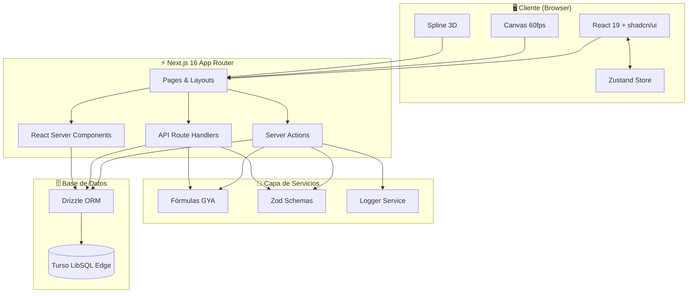
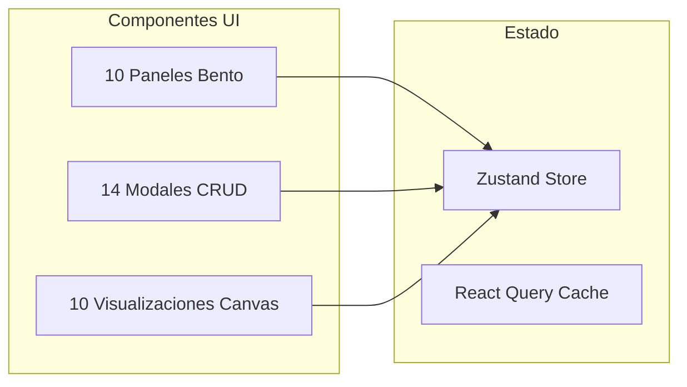
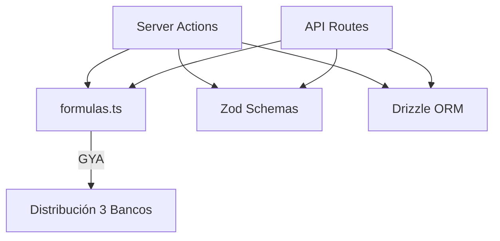
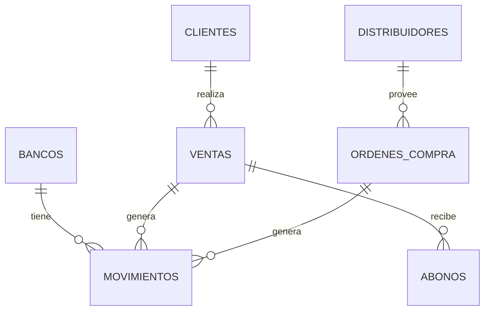
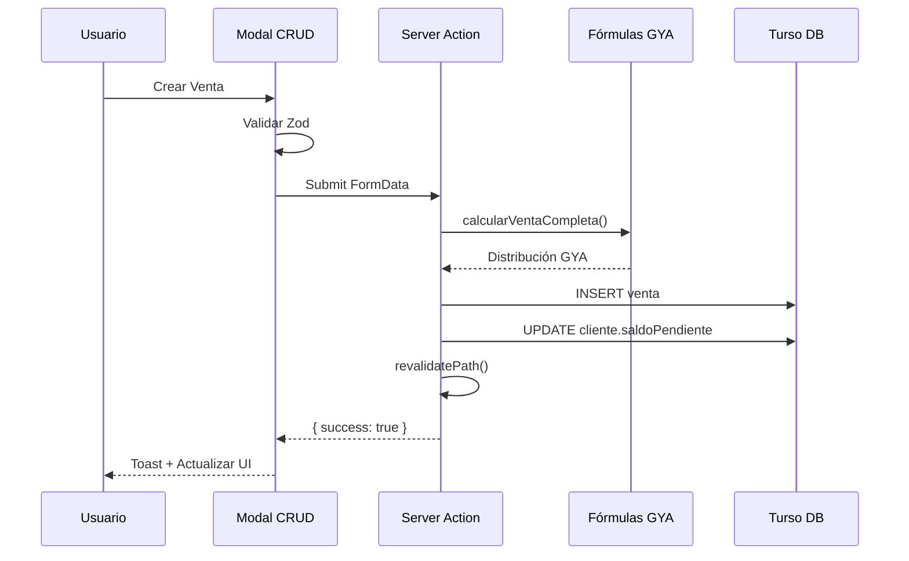
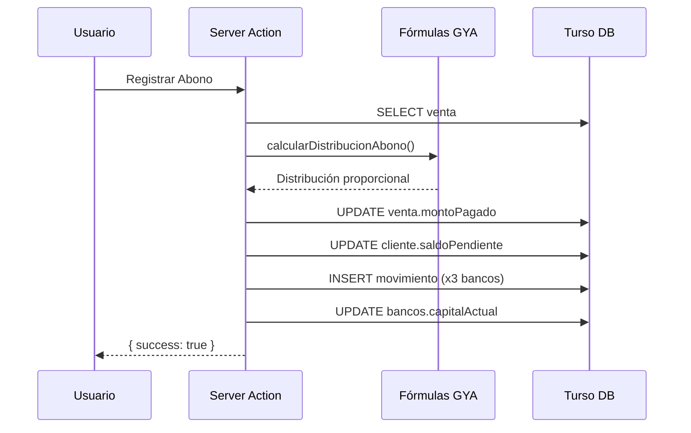
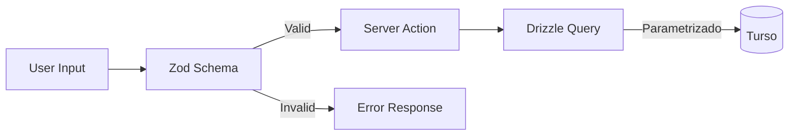
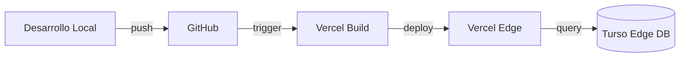

# 🏗️ ARQUITECTURA DEL SISTEMA CHRONOS

> Sistema empresarial de gestión financiera con dashboard premium

---

## 📐 Diagrama de Arquitectura



---

## 🏛️ Capas de la Arquitectura

### 1. Capa de Presentación (Frontend)



**Tecnologías:**

- React 19 con Server Components
- Tailwind CSS + shadcn/ui
- Framer Motion (animaciones)
- Canvas API + Spline 3D

### 2. Capa de Lógica de Negocio (Backend)



**Archivos Clave:**

- `app/_actions/` - 16 Server Actions
- `app/lib/formulas.ts` - Fórmulas centralizadas
- `app/lib/schemas/` - 9 schemas Zod

### 3. Capa de Datos (Persistencia)



**Tecnologías:**

- Turso (LibSQL Edge Database)
- Drizzle ORM (Type-safe queries)
- SQLite (desarrollo local)

---

## 🔄 Flujos de Datos

### Flujo de Venta



### Flujo de Abono



---

## 📁 Estructura de Directorios

```
chronos-elite/
├── app/
│   ├── _actions/              # 16 Server Actions
│   │   ├── ventas.ts
│   │   ├── bancos.ts
│   │   ├── clientes.ts
│   │   ├── ordenes.ts
│   │   └── ...
│   ├── _components/           # Componentes 2026
│   ├── components/
│   │   ├── panels/
│   │   │   └── definitivos/   # 10 Paneles Bento
│   │   ├── modals/            # 14 Modales CRUD
│   │   └── visualizations/    # 10 Canvas 60fps
│   ├── lib/
│   │   ├── formulas.ts        # Fórmulas GYA centralizadas
│   │   ├── store/             # Zustand stores
│   │   ├── schemas/           # Zod schemas
│   │   └── utils/
│   │       └── logger.ts      # Logger centralizado
│   ├── api/                   # 25 Route Handlers
│   └── types/
│       └── index.ts           # 741 líneas de tipos
├── database/
│   ├── schema.ts              # 912 líneas - Drizzle schema
│   └── index.ts               # Cliente Turso
├── __tests__/                 # 27 archivos Jest
└── e2e/                       # Playwright E2E
```

---

## 🔐 Seguridad

### Flujo de Validación



### Protecciones Implementadas

| Capa     | Protección           | Implementación                |
| -------- | -------------------- | ----------------------------- |
| Frontend | Validación Form      | react-hook-form + zodResolver |
| Backend  | Validación Server    | Zod schemas                   |
| Database | SQL Injection        | Drizzle parametrizado         |
| Secrets  | Variables de Entorno | .env.local (gitignored)       |

---

## 📊 Patrones de Diseño

### 1. Server Actions Pattern

```typescript
// app/_actions/ventas.ts
'use server'

export async function createVenta(formData: FormData) {
  const parsed = CreateVentaSchema.safeParse(rawData)
  if (!parsed.success) return { error: 'Datos inválidos' }

  const resultado = calcularVentaCompleta(parsed.data)

  await db.transaction(async (tx) => {
    await tx.insert(ventas).values({...})
    await tx.update(clientes).set({...})
  })

  revalidatePath('/ventas')
  return { success: true }
}
```

### 2. Zustand Store Pattern

```typescript
// app/lib/store/useAppStore.ts
export const useAppStore = create<AppState>()(
  devtools(
    persist(
      (set) => ({
        currentPanel: "dashboard",
        theme: "dark",
        setCurrentPanel: (panel) => set({ currentPanel: panel }),
      }),
      { name: "chronos-ui-storage" }
    )
  )
)
```

### 3. Canvas Animation Pattern

```typescript
// Cleanup correcto en todos los componentes Canvas
useEffect(() => {
  const animationId = requestAnimationFrame(animate)
  return () => cancelAnimationFrame(animationId)
}, [])
```

---

## 🚀 Despliegue



### Variables de Entorno Requeridas

| Variable            | Ambiente | Requerida   |
| ------------------- | -------- | ----------- |
| DATABASE_URL        | All      | ✅          |
| DATABASE_AUTH_TOKEN | All      | ✅          |
| NEXTAUTH_SECRET     | All      | ✅          |
| NEXTAUTH_URL        | All      | ✅          |
| OPENAI_API_KEY      | Prod     | ❌ Opcional |

---

> **Última actualización:** 20 de Diciembre, 2025
