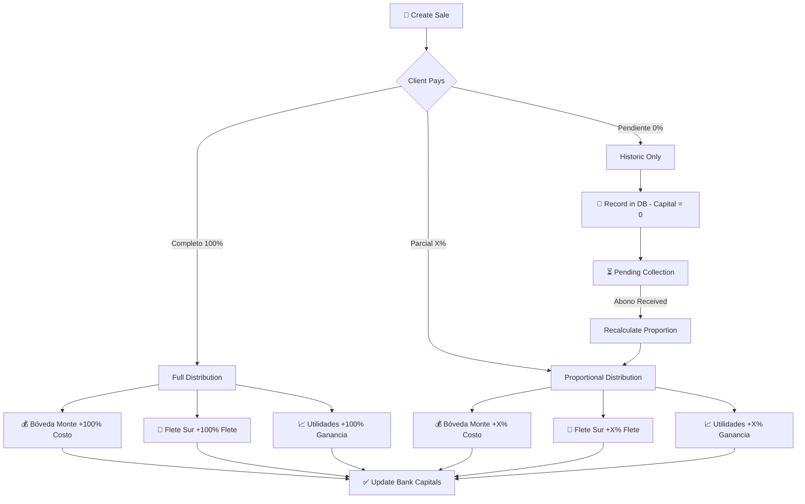

# 🔬 CHRONOS INFINITY 2026 — Comprehensive Research Report

> **Generated:** January 29, 2026  
> **Workspace:** `c:\Users\xpovo\Downloads\v0-crypto-dashboard-design-reference\v0-crypto-dashboard-design-feature-3d-integration-panels`

---

## 📋 Executive Summary

The CHRONOS INFINITY 2026 project is a sophisticated financial management system built with Next.js 15, featuring:
- **GYA (Gastos y Ahorros)** — Core financial distribution engine
- **10 Aurora Panels** — Premium unified dashboard components
- **Drizzle ORM + Turso** — Database layer with SQLite
- **React Query** — Data fetching and caching
- **37+ Custom Hooks** — State management and feature logic
- **44+ API Routes** — REST endpoints for all operations

---

## 1️⃣ GYA (Gastos y Ahorros) Financial Distribution System

### 🎯 Overview

The GYA system is the **core business logic** that distributes sales revenue across three sacred banks:

```
┌─────────────────────────────────────────────────────────────────────────────────────┐
│ 💰 FÓRMULA GYA (INMUTABLE — GRABADA EN PIEDRA)                                      │
├─────────────────────────────────────────────────────────────────────────────────────┤
│ 🏦 Bóveda Monte = precioCompra × cantidad             (COSTO del distribuidor)      │
│ 🚚 Flete Sur    = precioFlete × cantidad              (TRANSPORTE)                  │
│ 📈 Utilidades   = (precioVenta - precioCompra - precioFlete) × cantidad (GANANCIA)  │
└─────────────────────────────────────────────────────────────────────────────────────┘
```

### 📊 Complete Flow: Sales Creation → Bank Distribution



### 📂 Source Files for GYA Logic

| File | Purpose | Status |
|------|---------|--------|
| `app/_lib/gya-formulas.ts` | **CANONICAL** — Single source of truth | ✅ Primary |
| `app/lib/formulas.ts` | Legacy formulas | `⚠️ DUPLICATE` |
| `app/lib/schemas/business-operations.schema.ts` | Zod schemas + validation | ⚠️ Has own calc |
| `app/_lib/gya/distribucion-gya.ts` | Alternative implementation | ⚠️ DUPLICATE |
| `app/_lib/utils/gya-calculo.ts` | Utils wrapper | ⚠️ DUPLICATE |
| `app/lib/store/useFinanceStore.ts` | Zustand store with GYA | ⚠️ DUPLICATE |
| `app/_lib/core/FlowDistributorEngine.ts` | Engine implementation | ⚠️ Has `FLETE_DEFAULT_USD` |
| `e2e/utils/helpers.ts` | E2E test helpers | ⚠️ DUPLICATE |

### ⚠️ CRITICAL: Duplicate `calcularDistribucionGYA` Implementations Found

```typescript
// Found 10+ implementations across the codebase!
// This causes potential inconsistencies
```

**Files with duplicate implementations:**
1. `app/_lib/gya-formulas.ts` (Lines 142-184) — **CANONICAL**
2. `app/lib/formulas.ts` (Lines 101-123) — Legacy
3. `app/lib/schemas/business-operations.schema.ts` (Lines 544-598)
4. `app/_lib/gya/distribucion-gya.ts` (Lines 92-140)
5. `app/_lib/utils/gya-calculo.ts` (Lines 39+)
6. `app/lib/store/useFinanceStore.ts` (Lines 159+)
7. `e2e/utils/helpers.ts` (Lines 335+)
8. `__tests__/schemas/bank-distribution.test.ts` (Lines 38+) — Test helper

### 📍 GYA Constants

| Constant | Value | Location |
|----------|-------|----------|
| `FLETE_DEFAULT` | 500 | `app/_lib/gya-formulas.ts:26` |
| `FLETE_DEFAULT_USD` | 500 | `app/_lib/core/FlowDistributorEngine.ts:218` |
| `PRECIO_FLETE_DEFAULT` | 500 | `app/_lib/services/business-logic-drizzle.service.ts:51` |

---

## 2️⃣ Aurora Panels Architecture

### 🌟 Complete Panel Map

| # | Panel Name | Location | Lines | Data Hook | Primary Function |
|---|-----------|----------|-------|-----------|-----------------|
| 1 | `AuroraDashboardUnified` | `panels/AuroraDashboardUnified.tsx` | 815 | `useDashboardData` | Main dashboard with KPIs, activity feed |
| 2 | `AuroraBancosPanelUnified` | `panels/AuroraBancosPanelUnified.tsx` | 3004 | `useBancosData` | 7 sacred banks, capital flow, transfers |
| 3 | `AuroraVentasPanelUnified` | `panels/AuroraVentasPanelUnified.tsx` | 2132 | `useVentasData` | Sales timeline, GYA preview, CRUD |
| 4 | `AuroraClientesPanelUnified` | `panels/AuroraClientesPanelUnified.tsx` | - | `useClientesData` | Client management, scoring, credit |
| 5 | `AuroraDistribuidoresPanelUnified` | `panels/AuroraDistribuidoresPanelUnified.tsx` | - | `useDistribuidoresData` | Distributor management, OC tracking |
| 6 | `AuroraAlmacenPanelUnified` | `panels/AuroraAlmacenPanelUnified.tsx` | - | `useAlmacenData` | Inventory, stock, entries/exits |
| 7 | `AuroraComprasPanelUnified` | `panels/AuroraComprasPanelUnified.tsx` | - | `useOrdenesCompraData` | Purchase orders, lot traceability |
| 8 | `AuroraGastosYAbonosPanelUnified` | `panels/AuroraGastosYAbonosPanelUnified.tsx` | - | `useMovimientosData` | Expenses/income management |
| 9 | `AuroraMovimientosPanel` | `panels/AuroraMovimientosPanel.tsx` | - | `useMovimientosData` | Financial movements timeline |
| 10 | `AuroraAIPanelUnified` | `panels/AuroraAIPanelUnified.tsx` | - | Custom AI hooks | ZERO AI assistant |

### 🔗 Panel Interconnections

```
                          ┌─────────────────────────┐
                          │  AuroraDashboardUnified │
                          │    (useDashboardData)   │
                          └───────────┬─────────────┘
                                      │ Aggregates from:
    ┌─────────────────────────────────┼─────────────────────────────────┐
    │                                 │                                 │
    ▼                                 ▼                                 ▼
┌───────────────┐           ┌─────────────────┐           ┌───────────────────┐
│ AuroraBancos  │◄────────►│  AuroraVentas   │◄────────►│  AuroraClientes   │
│ Panel         │   GYA    │  Panel          │   Deuda  │  Panel            │
│ (useBancos)   │ Distrib  │ (useVentas)     │          │ (useClientes)     │
└───────┬───────┘           └────────┬────────┘           └─────────┬─────────┘
        │                            │                              │
        │                            │                              │
        │ Capital                    │ Stock/Lotes                  │
        │ Flow                       ▼                              │
        │                  ┌─────────────────┐                      │
        │                  │ AuroraAlmacen   │                      │
        └─────────────────►│ Panel           │◄─────────────────────┘
                          │ (useAlmacen)    │     Product References
                          └────────┬────────┘
                                   │
                                   │ Entries from OC
                                   ▼
                          ┌─────────────────────┐
                          │ AuroraCompras       │
                          │ (useOrdenesCompra)  │
                          └────────┬────────────┘
                                   │
                                   │ From Distributors
                                   ▼
                          ┌─────────────────────────┐
                          │ AuroraDistribuidores    │
                          │ (useDistribuidores)     │
                          └─────────────────────────┘

─── Financial flow connections ───
    │
    ▼
┌─────────────────────────────────────────────────────────────────┐
│                     AuroraMovimientosPanel                       │
│                     AuroraGastosYAbonosPanel                     │
│                     (Track ALL financial movements)              │
└─────────────────────────────────────────────────────────────────┘
```

### 📁 Supporting Aurora Components

```
app/_components/chronos-2026/panels/
├── ActivityFeedVirtual.tsx     # Virtualized activity feed
├── index.ts                    # Exports
├── PanelErrorBoundary.tsx      # Error boundary wrapper
├── PremiumPanelEnhancer.tsx    # Premium loading states
├── SupremePanelBackgrounds.tsx # Shader backgrounds per panel
├── UltraPremiumDashboardDemo.tsx
└── VentasVirtualizedTimeline.tsx # Virtualized scroll for ventas
```

---

## 3️⃣ API Routes Structure

### 📂 Complete API Route Map (`app/api/`)

```
app/api/
├── abonos/             # Client payment management
├── actividades/        # Activity log
├── ai/                 # AI assistant endpoints
├── almacen/            # Inventory operations
├── analytics/          # Analytics endpoints
├── auth/               # Authentication
├── bancos/             # Bank operations ⭐
│   ├── route.ts        # GET (all), PUT (operations)
│   ├── sync/           # Bank synchronization
│   └── [bancoId]/      # Individual bank operations
├── capital/            # Capital management
├── chronos-ai/         # CHRONOS AI specific
├── clientes/           # Client CRUD ⭐
├── cortes/             # Bank cuts (cortes de caja)
├── crear-oc-completa/  # Complete OC creation
├── dashboard/          # Dashboard aggregation
├── db/                 # Database utilities
├── debug/              # Debug endpoints
├── distribuidores/     # Distributor CRUD ⭐
├── export/             # Data export
├── gastos/             # Expense management
├── health/             # Health check
├── ingresos/           # Income management
├── insights/           # Business insights
├── kpis/               # KPI calculations
├── metrics/            # Metrics
├── movimientos/        # Financial movements ⭐
├── notifications/      # Push notifications
├── ordenes/            # Purchase orders
├── pagos-distribuidor/ # Distributor payments
├── realtime-metrics/   # Real-time metrics SSE
├── reportes/           # Reports generation
├── reset-db/           # Database reset (dev)
├── saved-filters/      # User saved filters
├── scheduled-reports/  # Scheduled reports
├── search/             # Global search
├── sistema/            # System information
├── stats/              # Statistics
├── test-oc/            # OC testing
├── themes/             # Theme management
├── tipo-cambio/        # Currency exchange
├── transferencias/     # Bank transfers
├── user/               # User management
├── usuarios/           # User CRUD
├── ventas/             # Sales CRUD ⭐
│   ├── route.ts        # GET/POST ventas
│   ├── stats/          # Sales statistics
│   └── [id]/           # Individual sale operations
├── voice/              # Voice interface
└── workflows/          # Workflow automation
```

### 🔗 API → Component Relationships

| API Route | Used By Component | Data Hook |
|-----------|-------------------|-----------|
| `/api/bancos` | `AuroraBancosPanelUnified` | `useBancosData` |
| `/api/ventas` | `AuroraVentasPanelUnified` | `useVentasData` |
| `/api/clientes` | `AuroraClientesPanelUnified` | `useClientesData` |
| `/api/distribuidores` | `AuroraDistribuidoresPanelUnified` | `useDistribuidoresData` |
| `/api/almacen` | `AuroraAlmacenPanelUnified` | `useAlmacenData` |
| `/api/ordenes` | `AuroraComprasPanelUnified` | `useOrdenesCompraData` |
| `/api/movimientos` | `AuroraMovimientosPanel` | `useMovimientosData` |
| `/api/dashboard` | `AuroraDashboardUnified` | `useDashboardData` |

---

## 4️⃣ Database Schema Relationships

### 📊 Entity Relationship Diagram

```
┌────────────────────────────────────────────────────────────────────────────────────────┐
│                              CHRONOS INFINITY 2026 - DATABASE                           │
└────────────────────────────────────────────────────────────────────────────────────────┘

    ┌─────────────┐         ┌─────────────────┐         ┌─────────────────┐
    │  usuarios   │         │   clientes      │         │ distribuidores  │
    │─────────────│         │─────────────────│         │─────────────────│
    │ id (PK)     │         │ id (PK)         │         │ id (PK)         │
    │ email       │         │ nombre          │         │ nombre          │
    │ password    │         │ saldoPendiente  │         │ saldoPendiente  │
    │ nombre      │         │ limiteCredito   │         │ stockTotal      │
    │ role        │         │ scoreTotal      │         │ scoreTotal      │
    └──────┬──────┘         │ categoria       │         │ categoria       │
           │                └────────┬────────┘         └────────┬────────┘
           │                         │                           │
           │ createdBy               │ clienteId                 │ distribuidorId
           ▼                         ▼                           ▼
    ┌─────────────────────────────────────────────────────────────────────┐
    │                              ventas                                  │
    │─────────────────────────────────────────────────────────────────────│
    │ id (PK)          │ clienteId (FK)      │ productoId (FK)            │
    │ fecha            │ ocId (FK)           │ cantidad                   │
    │ precioVentaUnidad│ precioCompraUnidad  │ precioFlete                │
    │ precioTotalVenta │ montoPagado         │ montoRestante              │
    │ estadoPago       │ metodoPago          │ bancoDestino (FK)          │
    │─────────────────────────────────────────────────────────────────────│
    │ 💰 DISTRIBUCIÓN GYA (inmutable)                                     │
    │ montoBovedaMonte │ montoFletes         │ montoUtilidades            │
    │ capitalBovedaMonte (distribuido real)                               │
    │─────────────────────────────────────────────────────────────────────│
    │ 🔗 TRAZABILIDAD                                                     │
    │ origenLotes (JSON) │ numeroLotes                                    │
    └──────────────────────────────┬──────────────────────────────────────┘
                                   │
          ┌────────────────────────┼────────────────────────┐
          │                        │                        │
          ▼                        ▼                        ▼
    ┌──────────────┐        ┌─────────────┐         ┌──────────────┐
    │   abonos     │        │ movimientos │         │ salidaAlmacen│
    │──────────────│        │─────────────│         │──────────────│
    │ id (PK)      │        │ id (PK)     │         │ id (PK)      │
    │ ventaId (FK) │        │ bancoId (FK)│         │ ventaId (FK) │
    │ clienteId    │        │ tipo        │         │ productoId   │
    │ monto        │        │ monto       │         │ cantidad     │
    │ proporcion   │        │ concepto    │         │ origenLotes  │
    │ distribucionGYA       │ referencias │         └──────────────┘
    └──────────────┘        └─────────────┘

    ┌─────────────────┐         ┌─────────────────┐
    │     bancos      │◄────────│ ordenesCompra   │
    │─────────────────│         │─────────────────│
    │ id (PK)         │         │ id (PK)         │
    │ nombre          │         │ distribuidorId  │
    │ tipo (enum)     │         │ productoId      │
    │ capitalActual   │         │ cantidad        │
    │ historicoIngresos        │ stockActual     │
    │ historicoGastos          │ precioUnitario  │
    │ porcentajeDistribucionGYA│ montoPagado     │
    └─────────────────┘         │ montoRestante   │
                                │ gananciaTotal   │
                                │ eficienciaRotacion
                                └─────────────────┘
                                         │
                                         ▼
                                ┌─────────────────┐
                                │    almacen      │
                                │─────────────────│
                                │ id (PK)         │
                                │ nombre          │
                                │ sku             │
                                │ stockActual     │
                                │ precioCompra    │
                                │ precioVenta     │
                                │ clasificacionABC│
                                │ scoreTotal      │
                                └─────────────────┘
```

### 📋 Complete Table List

| Table | Purpose | Key Relationships |
|-------|---------|-------------------|
| `usuarios` | System users | → ventas.createdBy |
| `clientes` | Customer management | → ventas, abonos, movimientos |
| `distribuidores` | Supplier management | → ordenesCompra, pagosDistribuidor |
| `bancos` | 7 Sacred banks/vaults | → movimientos, ventas, OC |
| `ventas` | Sales records + GYA | → clientes, almacen, OC |
| `ordenesCompra` | Purchase orders | → distribuidores, almacen |
| `movimientos` | Financial movements | → bancos, clientes, ventas, OC |
| `abonos` | Payment history | → ventas, clientes |
| `almacen` | Inventory/Products | → ventas, OC |
| `entradaAlmacen` | Stock entries | → OC, almacen |
| `salidaAlmacen` | Stock exits | → ventas, almacen |
| `pagosDistribuidor` | Distributor payments | → OC, distribuidores, bancos |
| `kpisGlobales` | Daily KPI snapshots | Standalone |
| `aiChatMessages` | AI conversation history | → aiChatSessions |
| `aiChatSessions` | AI chat sessions | → aiChatMessages |

---

## 5️⃣ Hooks Architecture

### 📂 Complete Hook Inventory (`app/hooks/`)

| Hook | Purpose | Used By |
|------|---------|---------|
| **Data Hooks** | | |
| `useDataHooks.ts` | Unified data fetching | All Aurora panels |
| `useDashboardData.ts` | Dashboard aggregation | AuroraDashboardUnified |
| `useSystemData.ts` | System data wrapper | Legacy panels |
| `useTrazabilidad.ts` | Lot traceability | Ventas, Almacen panels |
| **Business Logic** | | |
| `useBusinessOperations.ts` | CRUD operations | Forms, modals |
| `useTreasury.ts` | Treasury management | Bancos panel |
| `useAuditLog.ts` | Audit trail | All operations |
| `usePermissions.ts` | Access control | All panels |
| **AI/Voice** | | |
| `useAI.ts` | AI integration | AuroraAIPanel |
| `useNexusAI.ts` | Advanced AI | AI features |
| `useVoiceAgent.ts` | Voice commands | Voice UI |
| `useVoiceInput.ts` | Voice input | Forms |
| `useZeroVoice.ts` | ZERO AI voice | AI panel |
| **Visual Effects** | | |
| `useQuantumSupreme.ts` | Supreme visual system | Premium panels |
| `useQuantumVisualEffects.ts` | WebGPU effects | Premium UI |
| `usePremiumAnimations.ts` | Cinematic animations | All panels |
| `useShader.ts` | WebGL shaders | Backgrounds |
| `useParticleSystem.ts` | Particle effects | Premium UI |
| `use3DInteraction.ts` | 3D interactions | 3D panels |
| `useWebGL.ts` | WebGL utilities | 3D effects |
| `useFrameLoop.ts` | Animation loop | Real-time visuals |
| **UX/UI** | | |
| `use-mobile.ts` | Mobile detection | Responsive UI |
| `useResponsive.tsx` | Responsive utilities | All panels |
| `useSoundEffect.ts` | Sound effects | Interactions |
| `useUISound.ts` | UI sounds | Buttons |
| `useMood.ts` | Mood-based theming | Adaptive UI |
| `useBioFeedback.ts` | Biometric feedback | Advanced UX |
| `useMediaPipePulse.ts` | MediaPipe integration | Bio features |
| **Performance** | | |
| `usePerformance.ts` | Performance monitoring | System |
| `use-lazy-loading.ts` | Lazy loading | Components |
| **Other** | | |
| `useAuth.tsx` | Authentication | Auth flows |
| `useCurrency.ts` | Currency conversion | Financial displays |
| `useMarketData.ts` | Market data | Crypto/stocks |
| `useRealtimeSync.ts` | Real-time sync | Data sync |
| `useChronosInfinity.ts` | System coordination | App-wide |
| `useEliteDashboard.ts` | Elite features | Premium features |
| `useFirestoreCRUD.ts` | Legacy Firebase | **DEPRECATED** |

### 🔗 Hook Dependencies

```
useDashboardData
    └── useDataHooks
        ├── useBancosData
        ├── useVentasData
        ├── useClientesData
        ├── useDistribuidoresData
        ├── useAlmacenData
        ├── useOrdenesCompraData
        └── useMovimientosData

useQuantumSupreme
    ├── useQuantumVisualEffects
    ├── usePremiumAnimations
    └── useShader

useVoiceAgent
    ├── useVoiceInput
    └── useZeroVoice
```

---

## 6️⃣ Code Duplication & Optimization Opportunities

### 🚨 Critical: GYA Formula Duplications

**Problem:** The `calcularDistribucionGYA` function is implemented in **10+ files**

**Impact:**
- Potential calculation inconsistencies
- Hard to maintain
- Increased bundle size
- Confusion about source of truth

**Recommendation:** Consolidate to single source in `app/_lib/gya-formulas.ts` and re-export from index.

### ⚠️ FLETE_DEFAULT Constant Duplications

| Location | Constant Name | Value |
|----------|--------------|-------|
| `app/_lib/gya-formulas.ts:26` | `FLETE_DEFAULT` | 500 |
| `app/_lib/core/FlowDistributorEngine.ts:218` | `FLETE_DEFAULT_USD` | 500 |
| `app/_lib/gya/distribucion-gya.ts:73` | `FLETE_DEFAULT` | 500 |
| `app/lib/formulas.ts:76` | `FLETE_DEFAULT` | 500 |

**Recommendation:** Create single `constants.ts` file and import everywhere.

### 📁 Duplicate File Structures

```
app/_lib/gya-formulas.ts      # ✅ KEEP - Canonical
app/_lib/gya/distribucion-gya.ts  # ❌ REMOVE - Duplicate
app/_lib/utils/gya-calculo.ts     # ❌ REMOVE - Duplicate
app/lib/formulas.ts               # ⚠️ DEPRECATE - Legacy
app/lib/store/useFinanceStore.ts  # ⚠️ REFACTOR - Extract GYA
```

### 🔧 Optimization Opportunities

1. **Bundle Size Reduction**
   - Remove duplicate GYA implementations (~5-10KB savings)
   - Consolidate utility functions

2. **Type Safety**
   - Create shared `types/gya.ts` for all GYA types
   - Use schema inference from Drizzle

3. **Performance**
   - `AuroraBancosPanelUnified.tsx` is 3004 lines — consider splitting
   - `AuroraVentasPanelUnified.tsx` is 2132 lines — consider splitting

4. **Code Organization**
   ```
   app/_lib/
   ├── gya/
   │   ├── index.ts           # Re-exports
   │   ├── formulas.ts        # SINGLE source for GYA
   │   ├── types.ts           # GYA types
   │   └── constants.ts       # FLETE_DEFAULT, etc.
   ```

### 📋 Legacy Code to Remove

| File | Reason |
|------|--------|
| `useFirestoreCRUD.ts` | Firebase removed, using Drizzle |
| `app/lib/formulas.ts` | Duplicate of `app/_lib/gya-formulas.ts` |
| `app/_lib/gya/distribucion-gya.ts` | Duplicate |
| `app/_lib/utils/gya-calculo.ts` | Duplicate wrapper |

---

## 7️⃣ Architecture Recommendations

### 🏗️ Proposed Refactoring

```
Phase 1: Consolidate GYA (Priority: HIGH)
├── Create app/_lib/gya/constants.ts
├── Merge all calcularDistribucionGYA to gya-formulas.ts
├── Update all imports
└── Remove duplicate files

Phase 2: Split Large Panels (Priority: MEDIUM)
├── AuroraBancosPanelUnified → Extract BancoCard, BancoForm
├── AuroraVentasPanelUnified → Extract VentaTimeline, VentaForm
└── Create shared Panel components

Phase 3: Type Consolidation (Priority: MEDIUM)
├── Create types/gya.ts
├── Use Drizzle inference
└── Remove duplicate type definitions

Phase 4: Hook Optimization (Priority: LOW)
├── Remove useFirestoreCRUD
├── Consolidate voice hooks
└── Document hook dependencies
```

---

## 📊 Summary Statistics

| Metric | Count |
|--------|-------|
| Aurora Panels | 10 |
| API Routes | 44+ directories |
| Custom Hooks | 37 |
| Database Tables | 15+ |
| Lines in Schema | 1670 |
| GYA Implementations | 10+ (should be 1) |
| Total Components | 100+ |

---

## ✅ Next Steps

1. **Immediate:** Fix GYA duplication (high risk of calculation bugs)
2. **Short-term:** Split large panel files for maintainability
3. **Medium-term:** Remove legacy code (Firebase references)
4. **Long-term:** Implement comprehensive test coverage for GYA

---

*Report generated by comprehensive workspace analysis*
