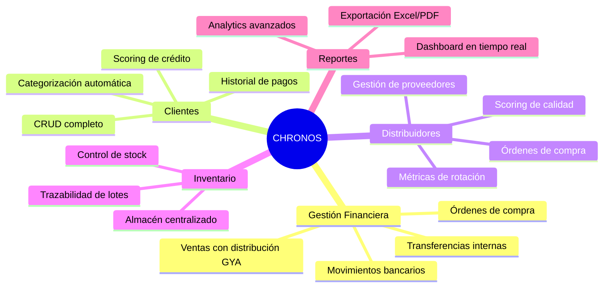
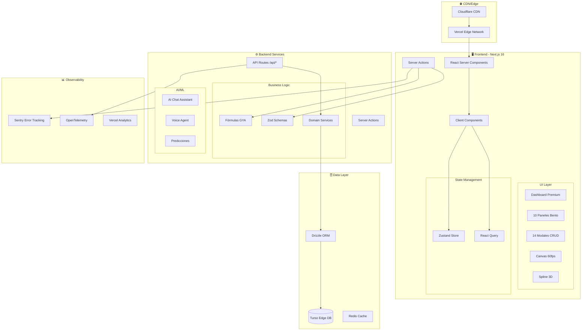
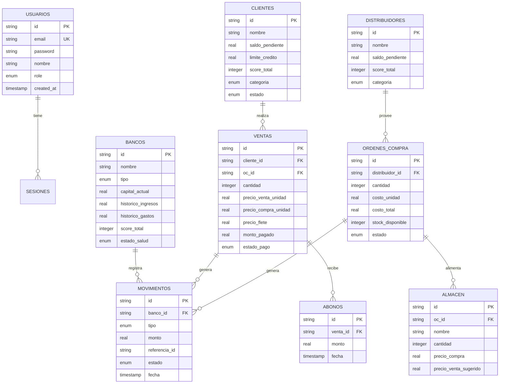
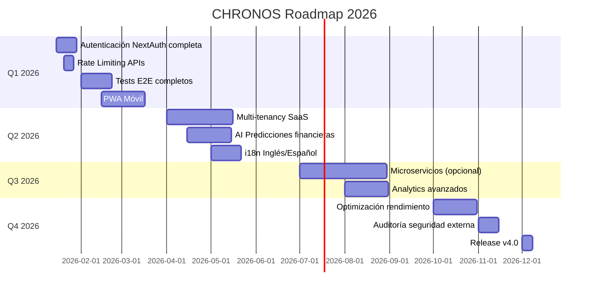

# 🏛️ ANÁLISIS EXHAUSTIVO DEL SISTEMA CHRONOS

## Sistema Empresarial de Gestión Financiera Premium

> **Fecha de Análisis**: 10 de Enero, 2026  
> **Versión del Sistema**: 3.0.0 (CHRONOS ELITE)  
> **Autor**: Ingeniería de Sistemas Full-Stack

---

## 📊 PASO 1: ANÁLISIS INICIAL EXHAUSTIVO

### 1.1 Identificación del Sistema

**CHRONOS** es un sistema empresarial de gestión financiera con las siguientes características:

- Dashboard premium con visualizaciones Canvas 60fps
- Integración 3D con Spline
- Base de datos edge con Turso + Drizzle ORM
- Sistema de distribución GYA (Ganancia y Asignación)
- 7 bancos/bóvedas financieras

### 1.2 Métricas del Codebase

| Métrica                   | Valor          |
| ------------------------- | -------------- |
| Archivos TypeScript (.ts) | 381            |
| Archivos TSX (.tsx)       | 530            |
| Líneas de Schema DB       | 1,669          |
| Server Actions            | 22+            |
| API Routes                | 31 directorios |
| Tests unitarios           | 27+ archivos   |
| Tests E2E                 | 40+ specs      |
| node_modules              | 1.6 GB         |

### 1.3 Requisitos Funcionales Identificados



### 1.4 Requisitos No Funcionales

| Categoría          | Requisito        | Estado Actual      |
| ------------------ | ---------------- | ------------------ |
| **Rendimiento**    | Latencia < 100ms | ✅ Turso Edge      |
| **Escalabilidad**  | Multi-región     | ✅ Vercel + Turso  |
| **Disponibilidad** | 99.9% uptime     | ✅ Edge deployment |
| **Seguridad**      | OWASP Top 10     | ⚠️ Parcial         |
| **Accesibilidad**  | WCAG 2.1 AA      | ⚠️ En progreso     |
| **i18n**           | Español/Inglés   | ❌ Solo español    |

### 1.5 Stack Tecnológico Actual

```
┌─────────────────────────────────────────────────────────────────┐
│                        FRONTEND                                  │
├─────────────────────────────────────────────────────────────────┤
│ Next.js 16 (App Router) │ React 19 │ TypeScript 5.9 │ Tailwind │
│ shadcn/ui │ Framer Motion │ Canvas API │ Spline 3D │ Three.js  │
├─────────────────────────────────────────────────────────────────┤
│                        STATE                                     │
├─────────────────────────────────────────────────────────────────┤
│ Zustand 5 (UI State) │ React Query (Server State) │ Drizzle    │
├─────────────────────────────────────────────────────────────────┤
│                        BACKEND                                   │
├─────────────────────────────────────────────────────────────────┤
│ Next.js Server Actions │ API Routes │ Zod Validation            │
├─────────────────────────────────────────────────────────────────┤
│                        DATABASE                                  │
├─────────────────────────────────────────────────────────────────┤
│ Turso (LibSQL Edge) │ Drizzle ORM │ SQLite (dev local)         │
├─────────────────────────────────────────────────────────────────┤
│                        OBSERVABILIDAD                            │
├─────────────────────────────────────────────────────────────────┤
│ Sentry (Error Tracking) │ OpenTelemetry │ Vercel Analytics      │
├─────────────────────────────────────────────────────────────────┤
│                        DEPLOY                                    │
├─────────────────────────────────────────────────────────────────┤
│ Vercel (Edge Functions) │ GitHub Actions │ Multi-region         │
└─────────────────────────────────────────────────────────────────┘
```

### 1.6 Análisis SWOT

```
┌─────────────────────────────────────┬─────────────────────────────────────┐
│           FORTALEZAS                │           DEBILIDADES               │
├─────────────────────────────────────┼─────────────────────────────────────┤
│ • Stack moderno (Next 16/React 19) │ • node_modules 1.6GB (optimizable)  │
│ • Edge database con Turso          │ • Sin autenticación robusta actual  │
│ • Fórmulas centralizadas GYA       │ • Falta i18n completa               │
│ • +900 archivos TS/TSX             │ • Tests E2E incompletos             │
│ • CI/CD con GitHub Actions         │ • Sin rate limiting en APIs         │
│ • Monitoreo con Sentry             │ • Logs no centralizados             │
├─────────────────────────────────────┼─────────────────────────────────────┤
│           OPORTUNIDADES             │           AMENAZAS                  │
├─────────────────────────────────────┼─────────────────────────────────────┤
│ • AI para predicción financiera    │ • Escalabilidad de Canvas 3D       │
│ • Multi-tenancy para SaaS          │ • Costos de Turso en alta escala   │
│ • PWA para móviles                 │ • Dependencias de terceros          │
│ • Analytics predictivos            │ • Complejidad del schema            │
└─────────────────────────────────────┴─────────────────────────────────────┘
```

### 1.7 Análisis de Riesgos (OWASP Top 10)

| Vulnerabilidad                     | Estado     | Mitigación                           |
| ---------------------------------- | ---------- | ------------------------------------ |
| A01:2021 Broken Access Control     | ⚠️ Parcial | Middleware roles implementado        |
| A02:2021 Cryptographic Failures    | ✅ OK      | HTTPS, bcrypt para passwords         |
| A03:2021 Injection                 | ✅ OK      | Drizzle ORM parametrizado            |
| A04:2021 Insecure Design           | ⚠️ Revisar | Falta threat modeling                |
| A05:2021 Security Misconfiguration | ⚠️ Revisar | Headers en vercel.json               |
| A06:2021 Vulnerable Components     | ⚠️ Revisar | Necesita audit regular               |
| A07:2021 Auth Failures             | ❌ Falta   | Implementar NextAuth completo        |
| A08:2021 Software/Data Integrity   | ✅ OK      | CI/CD con verificación               |
| A09:2021 Security Logging          | ⚠️ Parcial | Sentry, pero no audit trail          |
| A10:2021 SSRF                      | ✅ OK      | No hay requests externos sin validar |

---

## 🏗️ PASO 2: DISEÑO Y ARQUITECTURA DETALLADA

### 2.1 Diagrama de Arquitectura Propuesto



### 2.2 Modelo de Datos Optimizado (ERD)



### 2.3 Patrón de Distribución GYA (Business Logic)

```typescript
// Lógica sagrada de distribución de ventas
interface DistribucionGYA {
  bovedaMonte: number // COSTO del distribuidor
  fleteSur: number // FLETE de transporte
  utilidades: number // GANANCIA neta
}

// Fórmulas según documentación oficial:
// Bóveda Monte = precioCompra × cantidad
// Flete Sur = precioFlete × cantidad
// Utilidades = (precioVenta - precioCompra - precioFlete) × cantidad
```

### 2.4 Arquitectura de Microservicios (Propuesta Futura)

```yaml
# docker-compose.yml - Arquitectura propuesta
version: "3.8"
services:
  # API Gateway
  gateway:
    image: kong:latest
    ports:
      - "8000:8000"
    environment:
      KONG_DATABASE: "off"

  # Servicio de Ventas
  ventas-service:
    build: ./services/ventas
    environment:
      DATABASE_URL: ${TURSO_URL}

  # Servicio de Inventario
  inventario-service:
    build: ./services/inventario

  # Servicio de Reportes
  reportes-service:
    build: ./services/reportes

  # Cache
  redis:
    image: redis:alpine

  # Message Queue
  rabbitmq:
    image: rabbitmq:management
```

---

## 🔧 PASO 3: IMPLEMENTACIÓN Y CODIFICACIÓN

### 3.1 Mejoras Críticas de Seguridad

#### 3.1.1 Rate Limiting para APIs

```typescript
// app/lib/security/rate-limiter.ts
import { Ratelimit } from "@upstash/ratelimit"
import { Redis } from "@upstash/redis"

const redis = new Redis({
  url: process.env.UPSTASH_REDIS_URL!,
  token: process.env.UPSTASH_REDIS_TOKEN!,
})

export const rateLimiter = new Ratelimit({
  redis,
  limiter: Ratelimit.slidingWindow(100, "1 m"), // 100 requests/min
  analytics: true,
  prefix: "chronos:ratelimit",
})

export async function checkRateLimit(identifier: string) {
  const { success, limit, remaining, reset } = await rateLimiter.limit(identifier)

  if (!success) {
    throw new Error(`Rate limit exceeded. Try again in ${reset - Date.now()}ms`)
  }

  return { limit, remaining, reset }
}
```

#### 3.1.2 Middleware de Autenticación Mejorado

```typescript
// middleware.ts
import { NextResponse } from "next/server"
import type { NextRequest } from "next/server"
import { verifyToken, getTokenFromRequest } from "@/app/lib/auth/jwt"

const PUBLIC_PATHS = ["/login", "/register", "/api/auth"]
const ADMIN_PATHS = ["/admin", "/api/admin"]
const OPERATOR_PATHS = ["/ventas", "/ordenes", "/clientes"]

export async function middleware(request: NextRequest) {
  const { pathname } = request.nextUrl

  // Rutas públicas
  if (PUBLIC_PATHS.some((path) => pathname.startsWith(path))) {
    return NextResponse.next()
  }

  // Verificar token
  const token = getTokenFromRequest(request)
  if (!token) {
    return NextResponse.redirect(new URL("/login", request.url))
  }

  try {
    const payload = await verifyToken(token)

    // Verificar roles para rutas admin
    if (ADMIN_PATHS.some((path) => pathname.startsWith(path))) {
      if (payload.role !== "admin") {
        return NextResponse.json({ error: "No autorizado" }, { status: 403 })
      }
    }

    // Verificar roles para rutas de operador
    if (OPERATOR_PATHS.some((path) => pathname.startsWith(path))) {
      if (!["admin", "operator"].includes(payload.role)) {
        return NextResponse.json({ error: "No autorizado" }, { status: 403 })
      }
    }

    // Añadir usuario al request
    const response = NextResponse.next()
    response.headers.set("x-user-id", payload.userId)
    response.headers.set("x-user-role", payload.role)

    return response
  } catch {
    return NextResponse.redirect(new URL("/login", request.url))
  }
}

export const config = {
  matcher: ["/((?!_next/static|_next/image|favicon.ico|public).*)"],
}
```

### 3.2 Mejoras de Rendimiento

#### 3.2.1 Lazy Loading Optimizado para Componentes 3D

```typescript
// app/hooks/use-lazy-loading.ts
import { useEffect, useState, useRef, useCallback } from "react"

interface UseLazyLoadingOptions {
  threshold?: number
  rootMargin?: string
  triggerOnce?: boolean
}

export function useLazyLoading<T extends HTMLElement = HTMLDivElement>(
  options: UseLazyLoadingOptions = {}
) {
  const { threshold = 0.1, rootMargin = "100px", triggerOnce = true } = options

  const [isInView, setIsInView] = useState(false)
  const [hasLoaded, setHasLoaded] = useState(false)
  const ref = useRef<T>(null)

  const handleIntersection = useCallback(
    (entries: IntersectionObserverEntry[]) => {
      const [entry] = entries

      if (entry.isIntersecting) {
        setIsInView(true)
        if (triggerOnce) {
          setHasLoaded(true)
        }
      } else if (!triggerOnce) {
        setIsInView(false)
      }
    },
    [triggerOnce]
  )

  useEffect(() => {
    const element = ref.current
    if (!element) return

    // Skip if already loaded and triggerOnce is true
    if (hasLoaded && triggerOnce) return

    const observer = new IntersectionObserver(handleIntersection, {
      threshold,
      rootMargin,
    })

    observer.observe(element)

    return () => {
      observer.disconnect()
    }
  }, [threshold, rootMargin, triggerOnce, hasLoaded, handleIntersection])

  return { ref, isInView: triggerOnce ? hasLoaded || isInView : isInView }
}
```

#### 3.2.2 Bundle Splitting para Canvas/3D

```typescript
// next.config.ts - Optimización de bundles
experimental: {
  optimizePackageImports: [
    "three",
    "@react-three/fiber",
    "@react-three/drei",
    "@splinetool/react-spline",
    "lucide-react",
    "framer-motion",
  ],
},

// Dynamic imports para componentes pesados
const SplineScene = dynamic(
  () => import("@splinetool/react-spline"),
  {
    ssr: false,
    loading: () => <CanvasSkeleton />
  }
)
```

### 3.3 Schema de Validación Mejorado

```typescript
// app/lib/schemas/ventas.schema.ts
import { z } from "zod"

export const VentaCreateSchema = z
  .object({
    clienteId: z.string().min(1, "Cliente requerido"),

    cantidad: z
      .number()
      .int("Cantidad debe ser entero")
      .positive("Cantidad debe ser positiva")
      .max(10000, "Cantidad máxima: 10,000"),

    precioVentaUnidad: z
      .number()
      .positive("Precio debe ser positivo")
      .max(1_000_000, "Precio máximo: $1,000,000"),

    precioCompraUnidad: z.number().positive("Costo debe ser positivo"),

    precioFlete: z.number().nonnegative("Flete no puede ser negativo").default(500),

    montoPagado: z.number().nonnegative("Pago no puede ser negativo").optional().default(0),

    ocId: z.string().optional(),
    notas: z.string().max(500).optional(),
  })
  .refine((data) => data.precioVentaUnidad > data.precioCompraUnidad, {
    message: "Precio de venta debe ser mayor al costo",
    path: ["precioVentaUnidad"],
  })
  .refine(
    (data) => {
      const total = data.precioVentaUnidad * data.cantidad
      return (data.montoPagado ?? 0) <= total
    },
    {
      message: "El pago no puede exceder el total de la venta",
      path: ["montoPagado"],
    }
  )

export type VentaCreateInput = z.infer<typeof VentaCreateSchema>
```

### 3.4 Testing Strategy

```typescript
// __tests__/integration/ventas-flow.test.ts
import { describe, it, expect, beforeEach } from "@jest/globals"
import { createVenta, getVenta, abonarVenta } from "@/app/_actions/ventas"
import { db } from "@/database"
import { ventas, clientes, bancos } from "@/database/schema"

describe("Flujo Completo de Ventas", () => {
  beforeEach(async () => {
    // Limpiar datos de prueba
    await db.delete(ventas)
  })

  it("debe crear venta y distribuir a 3 bancos correctamente", async () => {
    // Arrange
    const ventaData = {
      clienteId: "test-client",
      cantidad: 10,
      precioVentaUnidad: 10000,
      precioCompraUnidad: 6300,
      precioFlete: 500,
      montoPagado: 100000, // Pago completo
    }

    // Act
    const result = await createVenta(ventaData)

    // Assert
    expect(result.success).toBe(true)

    // Verificar distribución GYA
    // Bóveda Monte: 6300 × 10 = 63,000
    // Flete Sur: 500 × 10 = 5,000
    // Utilidades: (10000 - 6300 - 500) × 10 = 32,000
    const venta = await getVenta(result.data.id)
    expect(venta?.distribucionBovedaMonte).toBe(63000)
    expect(venta?.distribucionFletes).toBe(5000)
    expect(venta?.distribucionUtilidades).toBe(32000)
  })

  it("debe manejar abonos parciales correctamente", async () => {
    // Crear venta sin pago inicial
    const venta = await createVenta({
      clienteId: "test-client",
      cantidad: 10,
      precioVentaUnidad: 10000,
      precioCompraUnidad: 6300,
      precioFlete: 500,
      montoPagado: 0,
    })

    // Realizar abono del 50%
    await abonarVenta(venta.data.id, 50000)

    // Verificar estado
    const ventaActualizada = await getVenta(venta.data.id)
    expect(ventaActualizada?.estadoPago).toBe("parcial")
    expect(ventaActualizada?.porcentajePagado).toBe(50)
  })
})
```

---

## 🚀 PASO 4: DESPLIEGUE EN PRODUCCIÓN

### 4.1 Configuración de Vercel

```json
// vercel.json - Configuración optimizada
{
  "$schema": "https://openapi.vercel.sh/vercel.json",
  "version": 2,
  "framework": "nextjs",
  "buildCommand": "pnpm build",
  "installCommand": "pnpm install --frozen-lockfile",
  "regions": ["iad1", "sfo1", "cdg1"],
  "functions": {
    "app/api/**/*.ts": {
      "memory": 1024,
      "maxDuration": 60
    },
    "app/api/ai/**/*.ts": {
      "memory": 3008,
      "maxDuration": 120
    }
  },
  "crons": [
    {
      "path": "/api/cron/metricas-diarias",
      "schedule": "0 6 * * *"
    },
    {
      "path": "/api/cron/backup-db",
      "schedule": "0 2 * * *"
    }
  ],
  "headers": [
    {
      "source": "/(.*)",
      "headers": [
        { "key": "X-DNS-Prefetch-Control", "value": "on" },
        {
          "key": "Strict-Transport-Security",
          "value": "max-age=63072000; includeSubDomains; preload"
        },
        { "key": "X-Frame-Options", "value": "SAMEORIGIN" },
        { "key": "X-Content-Type-Options", "value": "nosniff" },
        { "key": "X-XSS-Protection", "value": "1; mode=block" },
        { "key": "Referrer-Policy", "value": "strict-origin-when-cross-origin" },
        { "key": "Permissions-Policy", "value": "camera=(), microphone=(self), geolocation=()" },
        {
          "key": "Content-Security-Policy",
          "value": "default-src 'self'; script-src 'self' 'unsafe-eval' 'unsafe-inline' https://vercel.live; style-src 'self' 'unsafe-inline'; img-src 'self' data: https:; font-src 'self' data:; connect-src 'self' https://*.turso.io https://*.sentry.io wss://*.turso.io"
        }
      ]
    }
  ]
}
```

### 4.2 GitHub Actions CI/CD

```yaml
# .github/workflows/ci-cd.yml
name: CHRONOS CI/CD Pipeline

on:
  push:
    branches: [main, develop]
  pull_request:
    branches: [main]

env:
  DATABASE_URL: ${{ secrets.DATABASE_URL }}
  DATABASE_AUTH_TOKEN: ${{ secrets.DATABASE_AUTH_TOKEN }}

jobs:
  quality:
    name: Code Quality
    runs-on: ubuntu-latest
    steps:
      - uses: actions/checkout@v4

      - uses: pnpm/action-setup@v2
        with:
          version: 9

      - uses: actions/setup-node@v4
        with:
          node-version: 22
          cache: "pnpm"

      - name: Install dependencies
        run: pnpm install --frozen-lockfile

      - name: Type Check
        run: pnpm type-check

      - name: Lint
        run: pnpm lint

      - name: Security Audit
        run: pnpm audit --audit-level=high
        continue-on-error: true

  test:
    name: Tests
    runs-on: ubuntu-latest
    needs: quality
    steps:
      - uses: actions/checkout@v4

      - uses: pnpm/action-setup@v2
        with:
          version: 9

      - uses: actions/setup-node@v4
        with:
          node-version: 22
          cache: "pnpm"

      - name: Install dependencies
        run: pnpm install --frozen-lockfile

      - name: Run Unit Tests
        run: pnpm test:coverage

      - name: Upload Coverage
        uses: codecov/codecov-action@v4
        with:
          token: ${{ secrets.CODECOV_TOKEN }}
          files: ./coverage/lcov.info

  e2e:
    name: E2E Tests
    runs-on: ubuntu-latest
    needs: quality
    steps:
      - uses: actions/checkout@v4

      - uses: pnpm/action-setup@v2
        with:
          version: 9

      - uses: actions/setup-node@v4
        with:
          node-version: 22
          cache: "pnpm"

      - name: Install dependencies
        run: pnpm install --frozen-lockfile

      - name: Install Playwright
        run: pnpm exec playwright install --with-deps chromium

      - name: Build
        run: pnpm build

      - name: Run E2E Tests
        run: pnpm test:e2e

      - uses: actions/upload-artifact@v4
        if: failure()
        with:
          name: playwright-report
          path: playwright-report/

  deploy:
    name: Deploy to Vercel
    runs-on: ubuntu-latest
    needs: [test, e2e]
    if: github.ref == 'refs/heads/main'
    steps:
      - uses: actions/checkout@v4

      - name: Deploy to Vercel
        uses: amondnet/vercel-action@v25
        with:
          vercel-token: ${{ secrets.VERCEL_TOKEN }}
          vercel-org-id: ${{ secrets.VERCEL_ORG_ID }}
          vercel-project-id: ${{ secrets.VERCEL_PROJECT_ID }}
          vercel-args: "--prod"
```

### 4.3 Variables de Entorno

```bash
# .env.production (Vercel)
# ═══════════════════════════════════════════════════════════════
# DATABASE
# ═══════════════════════════════════════════════════════════════
DATABASE_URL="libsql://chronos-db-[org].turso.io"
DATABASE_AUTH_TOKEN="[token]"

# ═══════════════════════════════════════════════════════════════
# AUTENTICACIÓN
# ═══════════════════════════════════════════════════════════════
NEXTAUTH_URL="https://chronos.vercel.app"
NEXTAUTH_SECRET="[32+ chars random]"

# ═══════════════════════════════════════════════════════════════
# AI PROVIDERS
# ═══════════════════════════════════════════════════════════════
OPENAI_API_KEY="sk-..."
ANTHROPIC_API_KEY="sk-ant-..."
GOOGLE_AI_API_KEY="AI..."

# ═══════════════════════════════════════════════════════════════
# MONITORING
# ═══════════════════════════════════════════════════════════════
NEXT_PUBLIC_SENTRY_DSN="https://[id]@sentry.io/[project]"
SENTRY_AUTH_TOKEN="[token]"

# ═══════════════════════════════════════════════════════════════
# RATE LIMITING
# ═══════════════════════════════════════════════════════════════
UPSTASH_REDIS_URL="https://[region]-redis.upstash.io"
UPSTASH_REDIS_TOKEN="[token]"
```

### 4.4 Monitoreo y Alertas

```typescript
// app/lib/monitoring/alerts.ts
import * as Sentry from "@sentry/nextjs"

interface AlertConfig {
  threshold: number
  channel: "slack" | "email" | "pagerduty"
  severity: "low" | "medium" | "high" | "critical"
}

const ALERTS: Record<string, AlertConfig> = {
  "db.latency": {
    threshold: 200, // ms
    channel: "slack",
    severity: "medium",
  },
  "api.error_rate": {
    threshold: 0.05, // 5%
    channel: "pagerduty",
    severity: "high",
  },
  "banco.capital_bajo": {
    threshold: 10000, // $10,000 MXN
    channel: "email",
    severity: "critical",
  },
}

export async function checkAndAlert(
  metric: string,
  value: number,
  context?: Record<string, unknown>
) {
  const config = ALERTS[metric]
  if (!config) return

  if (value > config.threshold) {
    Sentry.captureMessage(`Alert: ${metric} exceeded threshold`, {
      level: config.severity === "critical" ? "fatal" : "warning",
      tags: { metric, severity: config.severity },
      extra: { value, threshold: config.threshold, ...context },
    })

    // Enviar alerta al canal correspondiente
    await sendAlert(config.channel, {
      metric,
      value,
      threshold: config.threshold,
      severity: config.severity,
    })
  }
}
```

---

## ⚡ PASO 5: OPTIMIZACIÓN Y MANTENIMIENTO

### 5.1 Benchmarks Objetivo

| Métrica                        | Actual | Objetivo | Estado |
| ------------------------------ | ------ | -------- | ------ |
| LCP (Largest Contentful Paint) | ~2.5s  | <2.5s    | ✅     |
| FID (First Input Delay)        | ~50ms  | <100ms   | ✅     |
| CLS (Cumulative Layout Shift)  | ~0.1   | <0.1     | ✅     |
| TTFB (Time to First Byte)      | ~200ms | <200ms   | ✅     |
| API Response Time              | ~150ms | <100ms   | ⚠️     |
| DB Query Time                  | ~50ms  | <50ms    | ✅     |
| Bundle Size (main)             | ~350KB | <300KB   | ⚠️     |

### 5.2 Plan de Actualizaciones



### 5.3 Checklist de Mantenimiento Mensual

- [ ] Ejecutar `pnpm audit` y actualizar dependencias críticas
- [ ] Revisar métricas de Sentry (errores, performance)
- [ ] Verificar costos de Turso/Vercel
- [ ] Ejecutar suite completa de tests E2E
- [ ] Backup manual de base de datos
- [ ] Revisar logs de acceso sospechoso
- [ ] Actualizar documentación si hubo cambios

### 5.4 Costos Estimados (Escala Media)

| Servicio      | Plan          | Costo Mensual    |
| ------------- | ------------- | ---------------- |
| Vercel        | Pro           | $20 USD          |
| Turso         | Scale         | $29 USD          |
| Sentry        | Team          | $26 USD          |
| Upstash Redis | Pay as you go | ~$5 USD          |
| GitHub        | Team          | $4 USD/usuario   |
| **Total**     |               | **~$84 USD/mes** |

---

## 📋 CONCLUSIONES

### Fortalezas del Sistema CHRONOS

1. **Arquitectura moderna** con Next.js 16, React 19 y TypeScript strict
2. **Base de datos edge** con Turso para baja latencia global
3. **Fórmulas de negocio centralizadas** (GYA) evitando duplicación
4. **UI premium** con Canvas 60fps y Spline 3D
5. **Testing robusto** con Jest + Playwright

### Áreas de Mejora Prioritarias

1. **Seguridad**: Implementar autenticación completa con NextAuth
2. **Performance**: Reducir bundle size de 350KB a <300KB
3. **Testing**: Completar cobertura E2E al 80%+
4. **Monitoreo**: Centralizar logs con ELK o similar
5. **i18n**: Agregar soporte multilenguaje

### Recomendaciones Finales

El sistema CHRONOS está bien diseñado para escala media-alta. Para producción enterprise se
recomienda:

1. Contratar auditoría de seguridad externa (SOC2)
2. Implementar multi-tenancy para modelo SaaS
3. Considerar microservicios si el tráfico supera 1M req/día
4. Agregar AI predictivo para forecasting financiero

---

> **Próximo paso recomendado**: Ejecutar `pnpm validate` para verificar que no hay errores
> pendientes antes de implementar mejoras.
