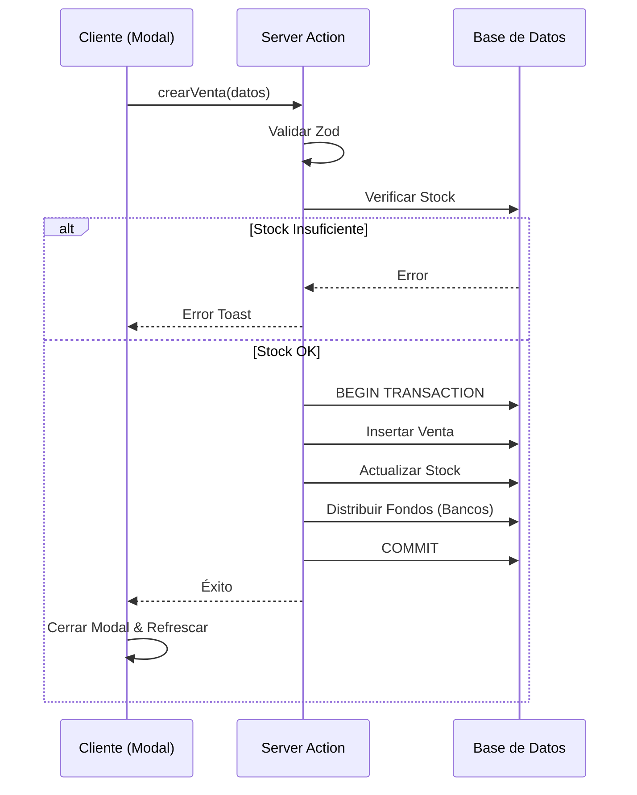

# Documentación Metodológica

## 1. Estructura del Proyecto

La organización sigue una metodología de "Features" dentro de la arquitectura de Next.js App Router.

```
app/
├── (dashboard)/       # Rutas protegidas de la aplicación
│   └── ventas/        # Página principal de ventas
├── _actions/          # Lógica de servidor (Backend for Frontend)
│   ├── ventas.ts      # API pública del módulo
│   └── flujos-*.ts    # Lógica transaccional compleja
├── _components/
│   └── chronos-2026/  # Sistema de Diseño
│       └── panels/
│           └── ventas/# Módulo refactorizado
│               ├── components/ # UI pura
│               ├── VentasContext.tsx # Estado
│               └── index.tsx # Punto de entrada
└── lib/
    └── schemas/       # Definiciones de validación (Zod)
```

## 2. Convenciones de Código

### Archivos
*   **Componentes**: PascalCase (`VentasTable.tsx`).
*   **Hooks**: camelCase con prefijo use (`useVentas.ts`).
*   **Utilidades/Acciones**: camelCase (`ventas.ts`).

### Ciclo de Vida del Dato
1.  **Origen**: Base de Datos (Postgres).
2.  **Transporte**: Server Action (JSON serializable).
3.  **Estado Cliente**: React Context / Query.
4.  **Vista**: Componente React.

## 3. Matriz de Trazabilidad

| Requisito | Componente UI | Acción Servidor | Tabla DB |
|-----------|---------------|-----------------|----------|
| Ver Ventas | `VentasTable` | `getVentas` | `ventas` |
| Crear Venta | `CreateVentaModal` | `crearVentaCompleta` | `ventas`, `movimientos`, `bancos` |
| Filtrar | `VentasHeader` | N/A (Cliente) | N/A |
| KPIs | `VentasStats` | `getVentasStats` | `ventas` (agregación) |

## 4. Diagramas de Secuencia (Interacciones Críticas)

### Creación de Venta

